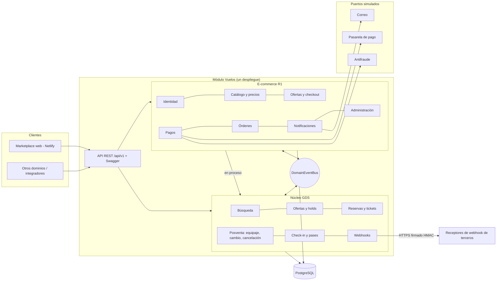
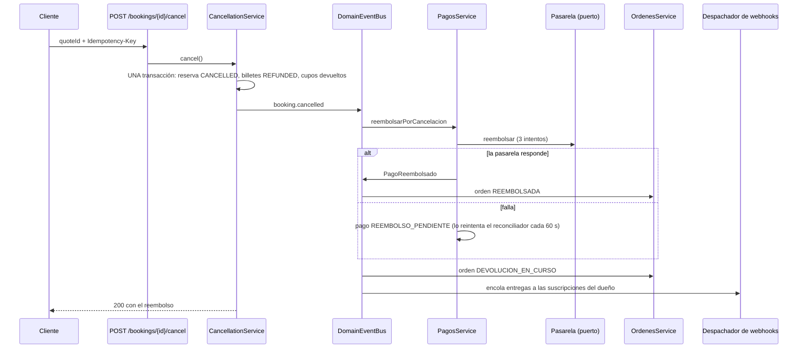

# Arquitectura orientada a servicios y eventos (SOA/EDA) — diseño preliminar

Documento de diseño de la preparación para integración futura del módulo Vuelos (fase **RDA1**: cada equipo funciona de forma independiente; la integración real entre dominios llega en RDA2+). Resume qué ya está construido, cómo se conectará con otros dominios y qué queda fuera de esta fase.

## 1. Principios

1. **API-first:** el contrato `contracts/vuelos-openapi.yaml` (OpenAPI 3.0.3) manda; el código lo implementa y el Swagger (`/api/docs`) lo publica. Los contratos de Alojamientos, Autos y Atracciones están en `contracts/` y siguen las mismas convenciones.
2. **Servicios detrás de puertos:** lo externo (pasarela de pago, antifraude, correo) es una interfaz con un adaptador **simulado**. Cambiar a un proveedor real no toca la lógica de negocio.
3. **Eventos de dominio:** los dominios del mismo despliegue no se llaman entre sí directamente; publican y consumen eventos. Un consumidor que falla se aísla y nunca hace fallar al productor.
4. **Idempotencia y reintentos seguros:** toda escritura crítica exige `Idempotency-Key`; los consumidores toleran recibir el mismo evento dos veces.
5. **Consistencia con compensación (saga):** la compra no es una transacción distribuida; se autoriza el pago, se emite todo en una transacción local y, si falla, se anula la autorización y se deja la orden `FALLIDA_COMPENSADA`.

## 2. Mapa de servicios



El e-commerce vende desde el inventario del núcleo **dentro del mismo proceso**, ejecutando `createHoldWithin` y `createBookingWithin` en su propia transacción. Esa frontera (`VuelosCoreModule` ⇄ `EcommerceModule`) es el punto por donde, en una fase posterior, el núcleo puede pasar a ser un servicio independiente consumido por HTTP o por mensajes.

## 3. El bus de eventos

`DomainEventBus` (`src/modules/vuelos/common/domain-event-bus.ts`) es un bus **en proceso**: no hay broker en esta fase. La forma de cada evento sigue el SRS §10.3:

```json
{
  "id": "uuid",
  "type": "booking.cancelled",
  "schemaVersion": 1,
  "occurredAt": "2026-10-07T15:04:05.000Z",
  "market": "ec",
  "correlationId": "uuid de la petición",
  "aggregateId": "id del agregado afectado",
  "payload": { "...": "datos del evento, sin datos personales" }
}
```

`publish()` es el único punto que habría que cambiar por un adaptador de broker (Kafka, RabbitMQ, SQS); productores y consumidores no se tocan.

## 4. Catálogo de eventos

### Núcleo de vuelos (nombres del contrato, `lower.snake`)

| Evento | Lo publica | Lo consumen |
|--------|-----------|-------------|
| `hold.expired`, `hold.released` | `OffersService` (vencimiento, barrido cada 30 s, liberación) | Ofertas del e-commerce (marca la oferta `VENCIDA`), webhooks |
| `booking.confirmed`, `booking.ticket_issuing`, `booking.ticket_issued` | `BookingsService` al confirmar la reserva | Webhooks |
| `booking.failed`, `booking.ticket_failed` | `BookingsService.announceFailed` (la emisión falló tras pasar las precondiciones) | Webhooks |
| `booking.baggage_added` | `BaggageService` | Webhooks |
| `booking.changed` | `DateChangeService`; administración al reprogramar un vuelo | Órdenes (`MODIFICADA → EMITIDA`), webhooks |
| `booking.cancelled` | `CancellationService`; administración al cancelar un vuelo | **Pagos** (reembolso por la pasarela), **Órdenes** (`DEVOLUCION_EN_CURSO`), webhooks |
| `booking.checked_in` | `CheckInService` | Webhooks |
| `flight.cancelled`, `flight.schedule_changed` | Acciones de administración `POST /admin/vuelos/{id}/cancelar` y `/reprogramar` | Webhooks |

### E-commerce (nombres del SRS, `PascalCase`)

| Evento | Lo publica | Lo consumen |
|--------|-----------|-------------|
| `OfertaCreada`, `OfertaVencida` | Ofertas | — (auditoría y observabilidad) |
| `PagoAutorizado`, `PagoRechazado`, `PagoAnulado` | Pagos | — |
| `PagoReembolsado` | Pagos tras reembolsar | Órdenes (`REEMBOLSADA`) |
| `OrdenEmitida`, `OrdenFallidaCompensada` | Compras (saga) | Notificaciones (correo de confirmación o de falla) |
| `ClienteRegistrado`, `CuentaBloqueada`, `ConsentimientoActualizado` | Identidad | Notificaciones |
| `ConfiguracionMercadoPublicada` | Mercados | — |

### Ejemplo: cancelar una reserva (coreografía por eventos)



## 5. Webhooks: eventos hacia sistemas externos

Los eventos del núcleo se exponen a terceros por **webhooks** (`GET/POST/DELETE /api/v1/webhooks`):

- Suscripción por dueño (`sub` del JWT), con la lista de eventos de interés y un secreto de 16 a 200 caracteres (cifrado, nunca se devuelve).
- Cada evento genera una entrega en `vuelos_webhook_deliveries` (única por suscripción y evento).
- El despachador (`webhook-dispatcher.service.ts`, cada 15 s, `FOR UPDATE SKIP LOCKED` para varias instancias) hace `POST` con las cabeceras `X-Webhook-Id`, `X-Webhook-Event`, `X-Webhook-Timestamp` y `X-Webhook-Signature: sha256=HMAC(secret, timestamp + "." + cuerpo)`.
- Reintentos a 1 min, 5 min, 30 min, 2 h y 6 h; luego la entrega queda `DEAD` y se ve en el panel de observabilidad.
- Seguridad (SSRF): solo `https`, sin credenciales en la URL, todas las IP resueltas deben ser públicas, se conecta a la IP ya validada, sin redirecciones, con tiempo máximo y tope de tamaño de respuesta.
- Los cuerpos no incluyen datos personales: solo identificadores, estados e importes.

## 6. Reconciliación (sustituto del outbox)

Sin broker, la consistencia eventual la garantiza `ReconciliacionService` (cada 60 s): captura los pagos `CAPTURA_PENDIENTE`, anula los `ANULACION_PENDIENTE`, reintenta los `REEMBOLSO_PENDIENTE` y reenvía la confirmación de las órdenes emitidas sin notificación. Cada paso es idempotente.

## 7. Preparación para integrar con otros dominios (RDA2+)

| Necesidad futura | Qué ya está listo | Qué faltaría |
|------------------|-------------------|--------------|
| Pago real, Billing y Customer externos | Puertos `PasarelaPago`, antifraude y correo con adaptadores simulados | Escribir el adaptador real y configurarlo |
| IdP externo | Verificación de JWT HS256 aislada en `auth/`; `ownerId` siempre sale del `sub` verificado | Validar contra las claves del IdP (RS256/JWKS) |
| Paquetes (vuelo + hotel + auto) | Contratos OpenAPI de los 4 dominios, mismas convenciones de error (`problem+json`), idempotencia y `ownerId` | Un orquestador que combine los holds de cada dominio |
| Broker de mensajes | Eventos con forma estándar (SRS §10.3), productores y consumidores desacoplados | Un adaptador en `DomainEventBus.publish()` y un outbox transaccional |
| Notificar a terceros hoy | Webhooks firmados con reintentos | — |

## 8. Fuera de esta fase (decisiones documentadas)

Sin broker ni outbox transaccional; pasarela, antifraude y correo simulados; vuelos directos, cabina económica y búsqueda por día UTC; los eventos `flight.*` los producen acciones de administración (no hay una fuente operativa real de aerolíneas).
