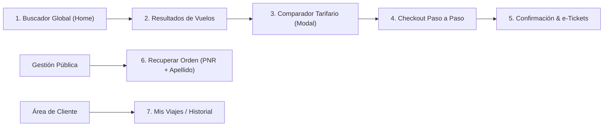

# Informe Integral de Desarrollo Frontend · Plataforma de Vuelos Star Alliance

**Proyecto:** Plataforma Web de Venta y Reserva de Vuelos Directos  
**Marca & Identidad:** Star Alliance ("The way the Earth connects")  
**Fecha:** Octubre 2026  
**Ubicación de Código:** `frontend/`  
**API Backend:** NestJS REST API desplegada en Render (`https://proyect-flights-rda1-plantilla.onrender.com/api/v1`)  
**Estado:** Iteraciones A, B, C implementadas y verificadas (12/12 pruebas unitarias aprobadas, compilación exitosa, 0 commits pendientes de confirmación).

---

## 1. Resumen Ejecutivo y Alcance del Sistema

Se desarrolló de forma integral la aplicación web frontend para la reserva y compra de billetes de avión en línea. El alcance del desarrollo es **exclusivo para vuelos comerciales** (descartando hoteles, alquiler de autos o paquetes turísticos). 

### Principios Rectores:
1. **Consumo no invasivo de API viva:** El frontend se adapta 100% al contrato OpenAPI existente y desplegado en Render. **No se modificó ninguna línea de código del backend**.
2. **Rebranding Global Star Alliance:** Se evolucionó la propuesta inicial hacia una identidad de alianza aérea internacional de prestigio mundial (**Star Alliance**), incorporando su emblema de 5 estrellas en vector SVG, gama cromática de lujo (`#0B0E14` negro obsidiana, `#C5A880` oro satinado, `#94A3B8` plata y `#0284C7` azul aviación) y soporte sin restricciones territoriales para las **24+ rutas internacionales** del catálogo (MIA, MAD, BOG, SCL, MEX, EZE, GYE, UIO, etc.).
3. **Mapeo Estándar de Divisas:** 
   - `USD ($) · Star Alliance Standard` (Mercado backend `ec`, cotización con 2 decimales).
   - `COP ($) · Colombia` (Mercado backend `co`, cotización sin decimales).
4. **Seguridad y Simulación Ética:** Los pagos operan mediante tokens de prueba sandbox sin almacenar ni transferir números de tarjeta reales.

---

## 2. Stack Tecnológico y Arquitectura Frontend

El proyecto se estructuró como una SPA (Single Page Application) estática, desacoplada y desplegable en servicios gratuitos como Vercel, Netlify o Cloudflare Pages:

| Capa / Tecnología | Herramienta | Propósito en el Proyecto |
| :--- | :--- | :--- |
| **Framework Base** | React 18 + Vite 6 | Renderizado reactivo rápido con Hot Module Replacement (HMR). |
| **Lenguaje & Tipado** | TypeScript 5.6 (strict mode) | Tipado estricto de extremo a extremo sin uso de `any` sueltos. |
| **Cliente de API** | `openapi-typescript` + Fetch API nativo | Generación automática de tipos TypeScript (`schema.d.ts`) desde `/api/docs-json`. |
| **Gestión de Estado Asíncrono**| TanStack Query v5 | Caché de búsquedas, revalidación en segundo plano y sondeo de ofertas. |
| **Enrutamiento** | React Router v6 | Navegación SPA con sincronización bidireccional por parámetros URL. |
| **Estilos & Diseño** | Tailwind CSS + CSS Variables | Sistema de diseño accesible (WCAG 2.1 AA) con clases resilientes. |
| **Formularios & Validación** | React Hook Form + Zod | Formularios paso a paso con validaciones dinámicas y schemas estrictos. |
| **Iconografía** | Lucide React + StarAllianceLogo SVG | Simbología moderna y emblema vectorial oficial. |
| **Pruebas Automatizadas** | Vitest 2.1 + Testing Library | Pruebas unitarias de dinero, fechas, problem details y tokens de pago. |

---

## 3. Resiliencia y Reglas de Negocio Implementadas

### A. Idempotencia Robusta (`Idempotency-Key`)
- Se implementó la generación de UUID v4 compatible con RFC 4122 (`generateUUID()`).
- La clave se genera una sola vez por intención de compra y **se reutiliza en reintentos automáticos o caídas de red**, garantizando que el usuario nunca sea cobrado dos veces ni se dupliquen ofertas.

### B. Manejo Riguroso de Dinero (Cero Floats)
- El backend entrega los montos como cadena de texto `{ moneda, monto }`.
- La utilidad `formatMoney()` utiliza `Intl.NumberFormat` adaptado al estándar financiero: COP sin decimales, USD con 2 decimales. Nunca se realiza aritmética con números de punto flotante en el cliente.

### C. Zonas Horarias y Sincronización UTC
- Las fechas en base de datos están en UTC (ISO 8601). La utilidad `formatTimeInTimeZone()` las traduce y visualiza en la hora local del aeropuerto respectivo.
- **Protección contra desfase UTC:** El backend en Render valida que `departureDate >= todayUtc()`. Para evitar el error `VALIDATION_FAILED: Departure date in the past` cuando los usuarios buscan en horario nocturno local (UTC-5), el frontend sincroniza la fecha mínima permitida con la fecha UTC del servidor y sugiere por defecto el día de mañana (`tomorrow`).

### D. Resiliencia ante Arranque en Frío de Render (~50s)
- El backend gratuito se suspende por inactividad. El cliente HTTP detecta peticiones que tardan más de 3 segundos y despliega globalmente el componente `WakeUpBanner` con animación y mensaje amigable en español *"Conectando con el servidor de vuelos..."*.

### E. Estandarización de Errores RFC 7807 (`application/problem+json`)
- Toda respuesta de error HTTP 4xx o 5xx se procesa extrayendo el campo `code`, `title`, `detail` y el array `invalidParams`.
- Se mapearon todos los códigos a español comprensible (`VALIDATION_FAILED`, `PAYMENT_DECLINED`, `PRICE_CHANGED`, `OFFER_EXPIRED`, etc.), asociando los errores de campo directamente a los inputs y habilitando un botón para ver el `X-Correlation-Id` con fines de soporte.

---

## 4. Detalle de Módulos y Pantallas Implementadas



### 1. Inicio y Buscador Global (`/`)
* **Componentes:** `HomePage.tsx`, `SearchBar.tsx`, `AirportPicker.tsx`, `PassengerSelector.tsx`.
* **Capacidades:**
  - Selector de viaje: Ida y vuelta (RT) y Solo ida (OW).
  - Autocompletado de aeropuertos con debounce (`GET /localidades?q=`), prevención de origen igual a destino y botón de intercambio (swap).
  - Selector de pasajeros con proporciones infante/adulto (máximo 1 infante por adulto, límite de 9 pasajeros por reserva).
  - Deep-linking transparente por URL (`origin, destination, outbound, inbound, adt, chd, inf, trip, sort, mercado`).

### 2. Resultados de Disponibilidad (`/resultados`)
* **Componentes:** `ResultsPage.tsx`, `FlightCard.tsx`, `SortingBar.tsx`, `DateNavigator.tsx`, `EmptyState.tsx`.
* **Capacidades:**
  - Consulta a `GET /disponibilidad` usando los criterios activos.
  - Tarjetas de vuelo directo con horarios en zona horaria local, badges (`RECOMENDADO`, `MAS_ECONOMICO`, `MAS_RAPIDO`) y aviso de escasez de asientos.
  - **Nuevo Navegador de Fechas (`DateNavigator`):** Carrusel interactivo continuo de 7 días (+/- 3 días respecto a la fecha consultada), botones de día anterior/siguiente, precios *"Desde..."* en tiempo real y selector de calendario directo.
  - Accesos rápidos en estado sin vuelos: *"Buscar mañana (+1 día)"*, *"Buscar en +2 días"*, *"Buscar en +3 días"*.
  - Navegación por pestañas para viajes de ida y vuelta (selección primero de ida y luego de vuelta).

### 3. Comparador de Familias Tarifarias
* **Componentes:** `FareComparisonModal.tsx`, `FareFamilyCard.tsx`.
* **Capacidades:**
  - Consulta de cotización vigente en `GET /itinerarios/:id/tarifas`.
  - Matriz comparativa entre familias **BASIC**, **LIGHT** y **FULL** detallando:
    - Equipaje de mano (artículo personal vs carry-on 10 kg).
    - Equipaje de bodega (0 vs 1 pieza de 23 kg).
    - Flexibilidad para cambios de fecha.
    - Política de devolución y reembolso.
    - Asignación de asiento previa al vuelo.
    - Factor de acumulación de millas Star Alliance.
  - Desglose de importe unitario por tipo de pasajero e impuestos incluidos.

### 4. Flujo de Checkout Paso a Paso (`/checkout/:offerId`)
* **Componentes:** `CheckoutPage.tsx`, `CheckoutStepper.tsx`, `CheckoutSummary.tsx`, `PassengerForm.tsx`, `BillingForm.tsx`, `ConditionsForm.tsx`, `PriceChangedModal.tsx`, `PaymentForm.tsx`.
* **Capacidades:**
  - **Retención de Cupo Garantizada:** Cuenta regresiva animada (`Countdown`) con la marca temporal `venceEn` (~15 minutos de reserva física de cupos).
  - **Paso 1 (Pasajeros y Contacto):** Genera formularios dinámicos según los tipos de pasajeros reservados (Adultos, Niños, Infantes). Permite vincular infantes en brazos con su adulto tutor (`asociadoA`), captura documentos (`PASSPORT` o `NATIONAL_ID`), viajero frecuente y teléfono en formato internacional E.164. Guarda en `PUT /ofertas/:id/pasajeros`.
  - **Paso 2 (Facturación):** Carga los tipos de identificación fiscal específicos del mercado activo desde `GET /mercados/:codigo` (RUC, Cédula, NIT). Guarda en `PUT /ofertas/:id/facturacion`.
  - **Paso 3 (Condiciones):** Visualización y aceptación obligatoria de los Términos Generales y del Contrato de Transporte Aéreo mediante modales interactivos. Envío a `POST /ofertas/:id/condiciones`.
  - **Paso 4 (Pago Seguro & Simulador Sandbox):**
    - Ejecuta revalidación de cotización (`POST /ofertas/:id/revalidacion`). Si el precio cambió (409 `PRICE_CHANGED`), activa `PriceChangedModal` para confirmar el nuevo valor vía `POST /ofertas/:id/aceptacion-precio`.
    - Selector de Tarjetas de Prueba (`VITE_SHOW_TEST_CARDS=true`):
      - Aprobadas: `tok_visa_ok` (VISA), `tok_mastercard_ok` (MASTERCARD), `tok_amex_ok` (AMEX), `tok_diners_ok` (DINERS).
      - Rechazos (402): `tok_declined`, `tok_insufficient`, `tok_expired`, `tok_fraud`, `tok_3ds`, `tok_review`.
      - Fallo de captura: `tok_visa_capture_fail`.
    - Envío de compra vía `POST /ofertas/:id/compra` con `Idempotency-Key` y cuotas permitidas según el mercado.

### 5. Confirmación y Billetes Electrónicos (`/confirmacion/:orderNumber`)
* **Componentes:** `ConfirmationPage.tsx`.
* **Capacidades:**
  - Localizador de reserva (**PNR**) de 6 caracteres con botón para copiar al portapapeles.
  - Número de orden comercial (`ORD-XXXXXX`) y estado oficial (`EMITIDA` / `PAGADA`).
  - Lista de pasajeros con sus billetes electrónicos individuales de 13 dígitos (`eTicket`).
  - Resumen completo de itinerario y liquidación de pago.
  - Botón de impresión con estilos optimizados `@media print` para exportar a PDF o papel sin elementos de interfaz.
  - Llamada a la acción para vincular la reserva a una cuenta Star Alliance.

### 6. Consulta Pública y Gestión de Reservas (`/recuperar-orden`)
* **Componentes:** `RetrieveOrderPage.tsx`.
* **Capacidades:**
  - Consulta pública y sin autenticación mediante **PNR o Número de Orden + Apellido obligatorio del pasajero**.
  - Protección de privacidad: mensaje genérico ante 404 para evitar enumeración de datos de contacto.
  - Enlace directo para abrir e imprimir el comprobante oficial.

### 7. Cuenta de Usuario e Historial (`/login`, `/mis-ordenes`)
* **Componentes:** `LoginPage.tsx`, `OrderHistoryPage.tsx`.
* **Capacidades:**
  - Inicio de sesión con correo y contraseña contra `POST /auth/login`.
  - Listado paginado por cursor de compras anteriores (`GET /clientes/me/ordenes`).
  - Botón directo para visualizar o reimprimir cualquier billete electrónico del historial.

---

## 5. Correcciones de UX/UI y Contraste Realizadas

Tras la inspección del entorno visual en el servidor local:
1. **Resolución del Contraste Blanco sobre Blanco:**
   - Se crearon utilitarios CSS blindados en `src/styles/index.css` (`.star-header-bg`, `.star-hero-bg`, `.star-tab-active`, `.star-gold-text`, `.star-gold-border`) junto a valores hexadecimales explícitos de Tailwind.
   - El Header ahora cuenta con fondo negro azabache `#0B0E14`, borde dorado y tipografía blanca/dorada nítida.
   - El Hero presenta un degradado noche profundo (`#05070A` -> `#0B0E14` -> `#0F172A`) con el título *"Vuela conectado por todo el mundo"* en blanco puro `#FFFFFF`.
   - Las pestañas de tipo de viaje ("Ida y vuelta") en el buscador tienen alto contraste con fondo negro, borde dorado y texto blanco.
2. **Navegación Dinámica de Fechas:**
   - Se resolvió la imposibilidad de explorar fechas contiguas directamente en los resultados, implementando el componente `DateNavigator` visible de manera ininterrumpida en la cabecera de resultados.

---

## 6. Estructura de Directorios del Módulo Frontend

```text
frontend/
├── dist/                              # Build optimizado para producción
├── public/
│   └── _redirects                     # Regla de reescritura SPA para Netlify/Cloudflare
├── src/
│   ├── api/
│   │   ├── endpoints/                 # Funciones REST conectadas al backend
│   │   │   ├── auth.ts                # Login, invitado, clientes
│   │   │   ├── catalog.ts             # Disponibilidad, localidades, tarifas
│   │   │   ├── markets.ts             # Configuración y textos legales del mercado
│   │   │   ├── offers.ts              # Ofertas, pasajeros, facturación, compra
│   │   │   └── orders.ts              # Consulta y recuperación pública de órdenes
│   │   ├── client.ts                  # Cliente fetch con Bearer, Idempotency-Key y warmup
│   │   ├── problem-details.ts         # Parser RFC 7807 y catálogo de errores en español
│   │   ├── schema.d.ts                # Contrato OpenAPI tipado generado automáticamente
│   │   └── types.ts                   # DTOs y tipos derivados
│   ├── components/
│   │   ├── common/                    # Countdown, MoneyText, ProblemAlert, WakeUpBanner
│   │   ├── layout/                    # Header y Footer Star Alliance
│   │   └── ui/                        # Button, Input, Dialog, Badge, Skeleton, StarAllianceLogo
│   ├── features/
│   │   ├── account/                   # LoginPage, OrderHistoryPage
│   │   ├── checkout/                  # Stepper, Pasajeros, Facturación, Condiciones, Pago
│   │   ├── confirmation/              # ConfirmationPage con PNR, e-Tickets y Print CSS
│   │   ├── fares/                     # FareComparisonModal, FareFamilyCard
│   │   ├── orders/                    # RetrieveOrderPage (PNR + Apellido)
│   │   ├── results/                   # ResultsPage, FlightCard, DateNavigator, SortingBar
│   │   └── search/                    # HomePage, SearchBar, AirportPicker, PassengerSelector
│   ├── lib/
│   │   ├── dates.ts                   # Formateo de fechas, zonas horarias y utilidades UTC
│   │   ├── money.ts                   # Formateo estricto Intl.NumberFormat por moneda
│   │   ├── storage.ts                 # Persistencia en sessionStorage
│   │   └── uuid.ts                    # Generador de UUID v4 para idempotencia
│   ├── routes/
│   │   └── index.tsx                  # Enrutador de la SPA
│   ├── styles/
│   │   └── index.css                  # Directivas Tailwind y utilidades Star Alliance
│   ├── App.tsx
│   └── main.tsx
├── tests/
│   └── unit/                          # Pruebas unitarias en Vitest
│       ├── checkout.test.ts           # UUID v4 y tokens sandbox
│       ├── dates.test.ts              # Conversión horaria y sumas de fechas UTC
│       ├── money.test.ts              # Formateo de COP y USD
│       └── problem-details.test.ts    # Mapeo de errores RFC 7807 a español
├── package.json
├── tailwind.config.js                 # Paleta Star Alliance y configuraciones de diseño
├── vite.config.ts                     # Configuración de Vite y proxy de desarrollo
└── README.md                          # Guía de instalación, variables de entorno y despliegue
```

---

## 7. Verificación Técnica y Calidad

### Pruebas Unitarias Automatizadas
Ejecutadas con `npm test -- --run`:
```text
 ✓ tests/unit/checkout.test.ts (2 tests)
 ✓ tests/unit/problem-details.test.ts (2 tests)
 ✓ tests/unit/money.test.ts (5 tests)
 ✓ tests/unit/dates.test.ts (3 tests)

 Test Files  4 passed (4)
      Tests  12 passed (12)
```

### Compilación y Empaquetado
Ejecutado con `npm run build`:
```text
> tsc && vite build

✓ 1686 modules transformed.
dist/index.html                   1.82 kB │ gzip:   0.74 kB
dist/assets/index-BCcNJVmO.css   45.84 kB │ gzip:   8.11 kB
dist/assets/index-DFNNdLYO.js   456.02 kB │ gzip: 128.91 kB
✓ built in 16.35s
```
Zero advertencias o errores de compilación TypeScript.

---

## 8. Guía para Despliegue en Producción

### En Vercel
1. Conectar el repositorio en [Vercel](https://vercel.com).
2. Establecer **Root Directory** en `frontend`.
3. Configurar variables de entorno:
   - `VITE_API_URL` = `https://proyect-flights-rda1-plantilla.onrender.com/api/v1`
   - `VITE_SHOW_TEST_CARDS` = `true`
4. Desplegar.

### En Netlify
1. Conectar el repositorio en [Netlify](https://netlify.com).
2. Base directory: `frontend`.
3. Build command: `npm run build`.
4. Publish directory: `dist`.
5. El archivo preconfigurado `frontend/public/_redirects` gestiona automáticamente las rutas de la SPA.

---

## 9. Política de Control de Versiones

Siguiendo las instrucciones del usuario:
- **No se ha efectuado ningún commit en Git.** Todo el código nuevo reside en el directorio de trabajo local (`working tree`), listo para ser revisado y confirmado por el usuario cuando lo disponga.
- **El backend de NestJS permanece 100% inalterado.**
