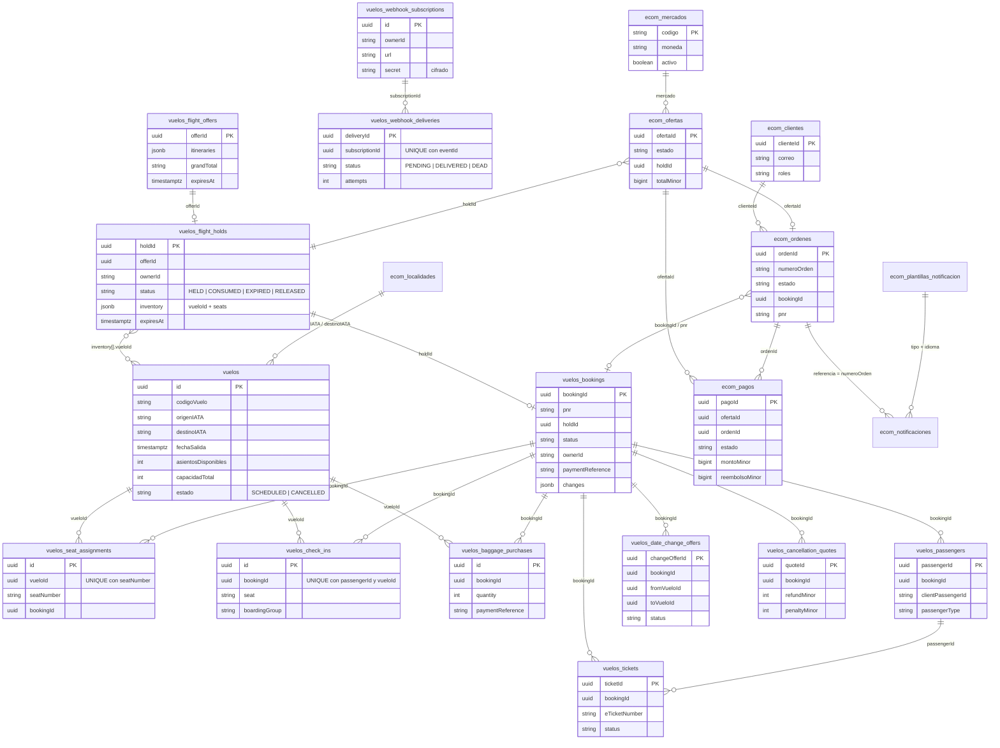

# Modelo de datos — módulo Vuelos

Esquema **real** de PostgreSQL generado desde las entidades TypeORM (`src/modules/vuelos/**/entities/*.entity.ts`) y versionado con migraciones (`src/modules/vuelos/migrations/`). Son **24 tablas** en dos grupos:

- **Núcleo de vuelos (GDS)**: prefijo `vuelos` / `vuelos_*` (15 tablas, incluidas las de posventa, check-in y webhooks).
- **E-commerce R1**: prefijo `ecom_*` (9 tablas).

> **Decisión de diseño:** el esquema no declara llaves foráneas (`FOREIGN KEY`). Las relaciones son **lógicas** (columnas `bookingId`, `holdId`, `vueloId`…, con índices) porque el e-commerce y el núcleo se integran dentro del proceso y, en fases siguientes, cada dominio podrá separarse en su propio servicio y base. La integridad la garantizan las transacciones (`UPDATE` condicional del inventario, bloqueo de la fila del hold, claves únicas) y no el motor de FKs. Los datos personales (pasajeros, contacto, facturación, cuerpo de notificaciones, secreto de webhook) se guardan **cifrados** (AES-256-GCM, columnas `jsonb`/`text` con prefijo `v1:`).

## 1. Diagrama entidad-relación (relaciones lógicas)

Solo se muestran las columnas clave de cada tabla; el diccionario completo está en la sección 3.



Tablas de apoyo sin relaciones de negocio fuertes (no dibujadas): `vuelos_fare_families` (tarifas BASIC/LIGHT/FULL, consultadas por código), `vuelos_idempotency_records` (clave compuesta `idempotencyKey + route + ownerId`), `ecom_auditoria_cambios` (bitácora de cambios de administración).

## 2. Reglas de integridad que sustituyen a las FKs

| Regla | Mecanismo |
|-------|-----------|
| Nunca se vende más cupo del que hay | `InventoryService`: `UPDATE vuelos SET asientosDisponibles = asientosDisponibles - n WHERE id = … AND asientosDisponibles >= n` (único escritor del contador). |
| Un asiento numérico no se asigna dos veces | `UNIQUE (vueloId, seatNumber)` en `vuelos_seat_assignments`. |
| Un hold se consume una sola vez | Bloqueo `pessimistic_write` de la fila del hold y `UPDATE … WHERE status = 'HELD'`. |
| Un vuelo no se duplica | `UNIQUE (codigoVuelo, fechaSalida)`; el seed usa `ON CONFLICT DO NOTHING`. |
| Un check-in por pasajero y tramo | `UNIQUE (bookingId, passengerId, vueloId)`. |
| Una entrega de webhook por evento y suscripción | `UNIQUE (subscriptionId, eventId)`. |
| Reintentos sin duplicar efectos | `vuelos_idempotency_records` con hash del cuerpo (misma clave y otro cuerpo → 422). |
| Dinero sin errores de redondeo | Montos en unidades menores enteras (`*Minor`, `bigint`/`int`). |

## 3. Diccionario de tablas

### Núcleo de vuelos (GDS)

| Tabla | Propósito | Columnas principales |
|-------|-----------|----------------------|
| `vuelos` | Inventario: un vuelo por día y frecuencia | `id`, `codigoVuelo`, `origenIATA`, `destinoIATA`, `fechaSalida`, `fechaLlegada`, `asientosDisponibles`, `capacidadTotal`, `durationMinutes`, `estado` |
| `vuelos_fare_families` | Familias tarifarias | `code` (BASIC/LIGHT/FULL), `changeable`, `refundable`, `seatSelectionIncluded`, `priceMultiplier` |
| `vuelos_flight_offers` | Oferta calculada por la búsqueda (con vencimiento) | `offerId`, `itineraries`, `grandTotal`, `expiresAt` |
| `vuelos_flight_holds` | Retención temporal de cupo | `holdId`, `offerId`, `ownerId`, `status`, `inventory`, `expiresAt` |
| `vuelos_bookings` | Reserva confirmada | `bookingId`, `pnr`, `holdId`, `status`, `ownerId`, `paymentReference`, `changes` |
| `vuelos_passengers` | Pasajeros de la reserva (datos personales) | `passengerId`, `bookingId`, `clientPassengerId`, `passengerType`, nombre y documento |
| `vuelos_tickets` | Billetes electrónicos | `ticketId`, `bookingId`, `passengerId`, `eTicketNumber`, `status` |
| `vuelos_seat_assignments` | Asientos numerados asignados | `vueloId`, `seatNumber`, `bookingId`, `passengerId` |
| `vuelos_baggage_purchases` | Equipaje extra comprado | `bookingId`, `passengerId`, `itineraryId`, `quantity`, `totalMinor`, `paymentReference` |
| `vuelos_date_change_offers` | Opciones de cambio de fecha (15 min) | `changeOfferId`, `fromVueloId`, `toVueloId`, `totalToPayMinor`, `status` |
| `vuelos_cancellation_quotes` | Cotizaciones de cancelación (15 min) | `quoteId`, `refundMinor`, `penaltyMinor`, `status` |
| `vuelos_check_ins` | Check-in por pasajero y tramo | `bookingId`, `passengerId`, `vueloId`, `seat`, `boardingGroup`, `boardingPosition` |
| `vuelos_webhook_subscriptions` | Suscripciones de webhooks | `ownerId`, `url`, `events`, `secret` (cifrado), `active` |
| `vuelos_webhook_deliveries` | Cola de entregas con reintentos | `subscriptionId`, `eventId`, `eventType`, `payload`, `status`, `attempts`, `nextAttemptAt` |
| `vuelos_idempotency_records` | Claves de idempotencia | PK compuesta `idempotencyKey + route + ownerId`, `requestHash`, `state`, `responseBody` |

### E-commerce R1 (SRS)

| Tabla | Propósito | Columnas principales |
|-------|-----------|----------------------|
| `ecom_localidades` | Catálogo de aeropuertos/ciudades | `iata`, `ciudad`, `nombre`, `pais`, `zonaHoraria` |
| `ecom_clientes` | Cuentas de clientes y administradores | `clienteId`, `correo`, `hashContrasena`, `roles`, `intentosFallidos`, `bloqueadoHasta` |
| `ecom_mercados` | Configuración por mercado (hoy solo `ec`, USD) | `codigo`, `moneda`, `mediosPago`, `reglasRegulatorias`, `activo`, `version` |
| `ecom_ofertas` | Oferta de compra y estado del checkout | `ofertaId`, `estado`, `trayectos`, `totalMinor`, `holdId`, `datosPasajeros` (cifrado), `venceEn` |
| `ecom_ordenes` | Orden de compra emitida | `ordenId`, `numeroOrden`, `estado`, `pnr`, `bookingId`, `pasajeros` (cifrado), `historial` |
| `ecom_pagos` | Pagos (autorización, captura, reembolso) | `pagoId`, `ofertaId`, `ordenId`, `estado`, `montoMinor`, `reembolsoMinor`, `autorizacionRef`, `antifraude` |
| `ecom_notificaciones` | Correos enviados (simulados) | `notificacionId`, `tipo`, `destinatario`, `referencia`, `estado`, `cuerpo` (cifrado) |
| `ecom_plantillas_notificacion` | Plantillas por tipo, mercado e idioma | `tipo`, `mercado`, `idioma`, `version`, `activa` |
| `ecom_auditoria_cambios` | Bitácora de cambios administrativos | `entidad`, `entidadId`, `actorId`, `accion`, `antes`, `despues` |

## 4. Estados principales

- **Hold:** `HELD → CONSUMED` (se convierte en reserva) · `HELD → EXPIRED` (vence) · `HELD → RELEASED` (el usuario lo libera).
- **Reserva (`vuelos_bookings.status`):** `CONFIRMED` · `TICKET_ISSUING` · `CHANGE_PENDING` · `CANCELLATION_PENDING` · `CANCELLED`.
- **Orden:** `PENDIENTE_PAGO → PAGADA → EMITIDA → (MODIFICADA → EMITIDA) | DEVOLUCION_EN_CURSO → REEMBOLSADA`; `FALLIDA_COMPENSADA` si la emisión falla tras autorizar el pago.
- **Pago:** `AUTORIZADO → CAPTURADO` · `CAPTURA_PENDIENTE` · `ANULADO` / `ANULACION_PENDIENTE` · `REEMBOLSADO` / `REEMBOLSO_PENDIENTE` · `RECHAZADO` / `RECHAZADO_ANTIFRAUDE`.
- **Entrega de webhook:** `PENDING → DELIVERED` o `DEAD` tras 6 intentos.

## 5. Cómo regenerar o comprobar este modelo

```bash
npm run migration:run:vuelos      # crea el esquema en una base vacía
npm run migration:check:vuelos    # debe terminar con código 0: las migraciones coinciden con las entidades
```
