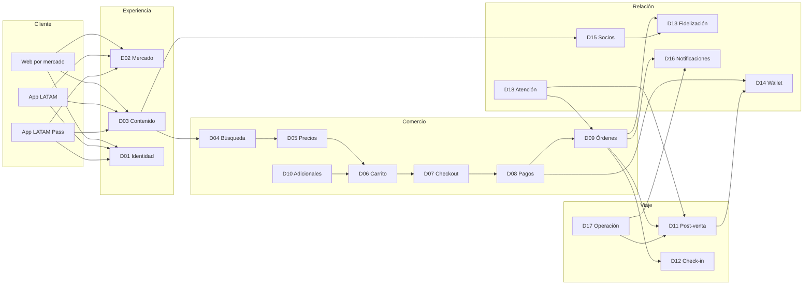
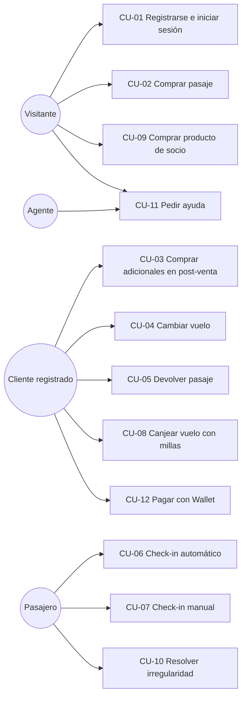
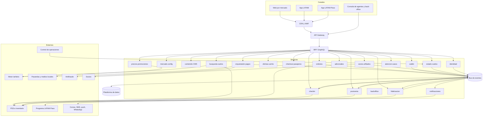
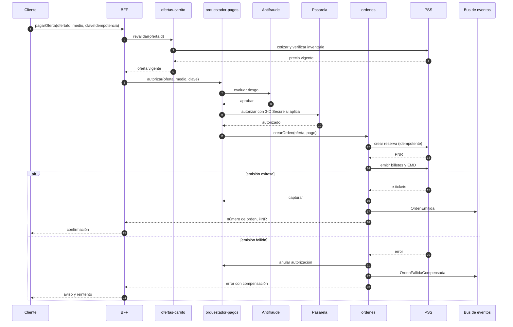
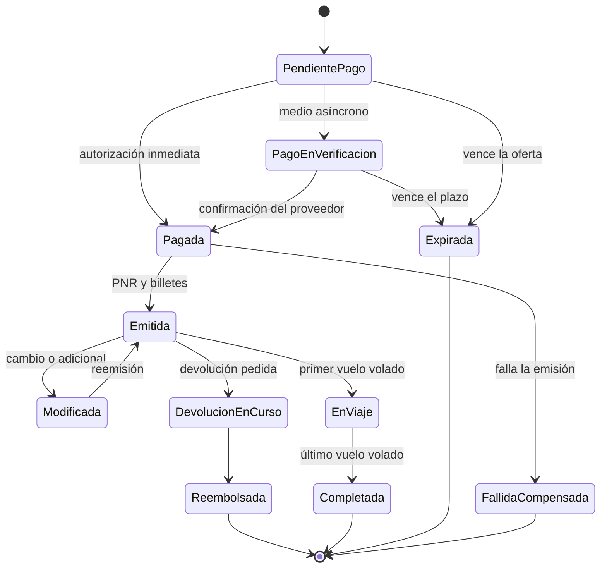
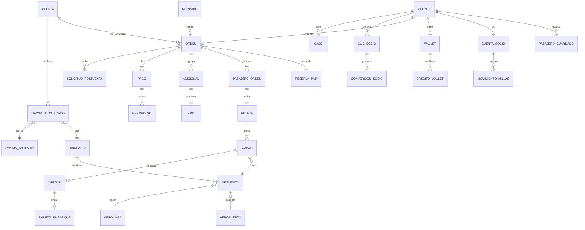
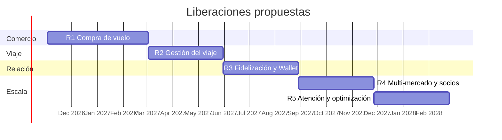

# Especificación de Requerimientos de Software (SRS)
## Plataforma de Comercio Electrónico — LATAM Airlines (sistema completo)

| Elemento | Detalle |
|---|---|
| Proyecto | Sistema de Vuelos — levantamiento y generación de microservicios |
| Sistema de referencia | latamairlines.com (portales por país) y sus canales asociados |
| Alcance | Plataforma completa tratada como e-commerce: identidad, mercado, contenido, búsqueda, precios, carrito, checkout, pagos, órdenes, servicios adicionales, post-venta, check-in, fidelización, billetera, productos de socios, notificaciones, operación, atención al cliente, back-office y analítica |
| Documento relacionado | SRS Núcleo de Vuelos v1.0 (21/09/2026), que se incorpora y se renumera en este documento |
| Norma de referencia | ISO/IEC/IEEE 29148 e IEEE 830, adaptadas |
| Versión | 1.0 |
| Fecha | 04/10/2026 |
| Elaborado por | Ingeniería de Sistemas — Análisis y Arquitectura |
| Estado | Emitido para revisión |

### Control de versiones

| Versión | Fecha | Autor | Cambio |
|---|---|---|---|
| 0.1 | 21/09/2026 | Análisis | SRS del núcleo de vuelos (documento independiente, v1.0). |
| 0.5 | 04/10/2026 | Análisis | Segundo recorrido del sitio: navegación global, Mis viajes, Check-in, Centro de ayuda y Ofertas. |
| 1.0 | 04/10/2026 | Análisis y Arquitectura | Especificación completa de la plataforma con 20 dominios, arquitectura de microservicios, contratos y trazabilidad. |

### Contenido

1. Introducción
2. Descripción general de la plataforma
3. Requerimientos funcionales por dominio
4. Reglas de negocio
5. Requerimientos no funcionales
6. Casos de uso
7. Historias de usuario y criterios de aceptación
8. Arquitectura de solución
9. Modelo de datos
10. Contratos de API y eventos
11. Matriz de trazabilidad
12. Plan de liberaciones
13. Riesgos, supuestos y asuntos abiertos
14. Anexos

---

## 1. Introducción

### 1.1 Propósito

Este documento especifica los requerimientos de la plataforma digital de LATAM Airlines entendida como un sistema de comercio electrónico completo. El SRS del núcleo de vuelos cubrió el camino crítico de compra de un pasaje; este documento amplía el alcance a todo lo que la plataforma vende, cobra, gestiona y atiende antes, durante y después del viaje.

Está dirigido a desarrollo, arquitectura, QA, producto, seguridad y operaciones. Sirve como base contractual para construir los microservicios y como fuente de los criterios de aceptación con los que QA arma sus planes de prueba.

### 1.2 Alcance

Se trata la plataforma como un **e-commerce híbrido** con tres líneas de ingreso:

- **Productos propios con inventario propio:** pasajes aéreos y servicios adicionales (asientos, equipaje, upgrade, LATAM Flex, mascotas). Se venden, cobran y emiten dentro de la plataforma.
- **Productos de socios por afiliación:** paquetes turísticos, alojamientos, alquiler de autos, actividades, traslados, eSIM, asistencia en viaje y entradas a parques. La plataforma los promociona, traslada contexto y atribución, y redirige al socio. La transacción ocurre fuera, pero la plataforma acredita millas y concilia comisiones.
- **Economía de fidelización:** acumulación y canje de millas LATAM Pass, categorías Elite y la billetera LATAM Wallet como medio de pago y depósito de créditos.

**Dentro del alcance:** los 20 dominios funcionales de la sección 2.4, sus integraciones y el back-office que los administra.

**Fuera del alcance:** sistemas internos de la aerolínea que la plataforma consume pero no construye (PSS e inventario, control de operaciones, sistemas de aeropuerto, contabilidad corporativa) y los sistemas propios de cada socio. Se documentan como interfaces.

### 1.3 Definiciones y acrónimos

| Término | Definición |
|---|---|
| PNR / código de reserva | Registro de reserva en el PSS. Localizador alfanumérico de seis caracteres. |
| Número de orden | Identificador comercial de la compra en la plataforma. El sitio lo admite como alternativa al código de reserva para acceder a Mis viajes y al check-in. |
| E-ticket | Billete electrónico de 13 dígitos, uno por pasajero. |
| EMD | Documento electrónico que respalda un servicio adicional. |
| PSS | Passenger Service System: inventario, reservas y control de salidas. |
| NDC / ONE Order | Estándares IATA de distribución por ofertas y órdenes. |
| Familia tarifaria | Conjunto comercial de condiciones (equipaje, cambios, devolución, asiento, upgrade, acumulación) ligado a una tarifa. |
| Ancillary | Servicio adicional al transporte. |
| Afiliado / socio | Proveedor externo cuyo producto se promociona y vende fuera de la plataforma bajo un acuerdo comercial. |
| Atribución | Parámetros que identifican mercado, ubicación y campaña de origen de un clic hacia un socio. |
| Millas LATAM Pass | Unidad de canje del programa de fidelización. |
| Puntos Calificables (PC) | Unidad que determina la categoría Elite del socio. |
| Categoría Elite | Gold, Platinum, Black o Black Signature. |
| LATAM Wallet | Billetera digital del cliente para pagar, recibir créditos y compensaciones. |
| LATAM Flex | Producto que permite devolver el pasaje y recibir su valor como crédito en la Wallet. |
| Retracto | Derecho legal de dejar sin efecto la compra dentro de un plazo, sin penalidad. |
| Desistimiento | Devolución voluntaria regulada con retención de un porcentaje. |
| Irregularidad | Atraso, adelanto o cancelación de un vuelo decidido por la aerolínea. |
| BFF | Backend for Frontend: capa de API específica por canal. |
| Saga | Patrón de transacción distribuida con pasos compensables. |
| SLO | Objetivo de nivel de servicio. |

### 1.4 Referencias

- SRS Núcleo de Vuelos v1.0, proyecto Sistema de Vuelos, 21/09/2026.
- Recorridos sobre el sitio productivo: portal de Colombia (21/09/2026) y portal de Ecuador (04/10/2026).
- Centro de ayuda LATAM: medios de pago, tarifas internacionales y domésticas, derecho de retracto en Colombia, opciones si te arrepientes de viajar, categorías Elite LATAM Pass.
- IATA: Distribution with Offers and Orders (NDC) y ONE Order.
- ISO/IEC/IEEE 29148; IEEE 830; WCAG 2.1 AA; PCI DSS v4.0; OWASP ASVS 4.0.
- Normativa de protección de datos y de consumidor de cada mercado de operación.

### 1.5 Metodología

El levantamiento combinó ingeniería inversa funcional sobre el sitio productivo con análisis documental.

- **Recorrido 1 (21/09/2026, portal Colombia):** búsqueda real BOG–SCL ida y vuelta, inspección del formulario, página de resultados, ordenamiento y panel de familias tarifarias.
- **Recorrido 2 (04/10/2026, portal Ecuador):** menú global y su mapa de socios, Mis viajes, Check-in, Centro de ayuda y landing de Ofertas.
- **Análisis documental:** centro de ayuda oficial para reglas no observables desde la interfaz (pagos, tarifas, retracto, desistimiento, traspaso, categorías Elite).

Cada requerimiento lleva su **origen**:

| Código | Significado |
|---|---|
| **O** | Observado directamente en el sitio productivo. |
| **D** | Documental: tomado de fuentes oficiales de LATAM. |
| **P** | Propuesto: práctica estándar del dominio o de e-commerce que el equipo recomienda incorporar. Requiere validación con negocio. |

La **prioridad** sigue MoSCoW: **Alta** (Must), **Media** (Should), **Baja** (Could).

---

## 2. Descripción general de la plataforma

### 2.1 Perspectiva del producto

La plataforma es la vitrina y la caja registradora de la aerolínea. Hacia el cliente, ofrece un recorrido continuo: inspirarse, buscar, comprar, gestionar el viaje, hacer check-in, volar, acumular y volver a comprar. Por dentro, es un conjunto de servicios que consumen sistemas núcleo (PSS, motor tarifario, control de operaciones, programa de fidelización) y socios externos.

Tres rasgos observados determinan la arquitectura:

1. **Multi-mercado de raíz.** Cada país tiene portal propio con idioma, moneda, productos del buscador, medios de pago, socios con identificadores de afiliación distintos y reglas regulatorias propias. En el recorrido 1 el buscador de Colombia mostró una pestaña de Asistencia en viaje; en el recorrido 2 la barra de productos de Ecuador mostró Vuelos, Paquetes, Alojamientos, Carros, Upgrade, eSIM y Universal.
2. **Modelo de oferta y orden.** El cliente arma una oferta que solo se vuelve orden cuando paga. La orden tiene un número comercial propio, distinto del código de reserva del PSS, y ambos sirven para recuperarla.
3. **E-commerce híbrido.** Los productos propios se transaccionan dentro; los de socios se derivan con atribución y vuelven como acumulación de millas.

### 2.2 Modelo de negocio y líneas de ingreso

| Línea | Productos | Dónde ocurre la transacción | Ingreso para la plataforma |
|---|---|---|---|
| Transporte | Pasajes en todas las familias y cabinas | Plataforma | Tarifa |
| Servicios adicionales | Asientos, equipaje, upgrade, LATAM Flex, mascotas | Plataforma | Precio del servicio |
| Afiliación | Paquetes, alojamientos, autos, actividades, traslados, eSIM, asistencia, parques | Socio | Comisión por conversión |
| Fidelización | Acumulación en compras propias y de socios; canje de vuelos, paquetes, hoteles y productos | Plataforma y programa | Venta de millas a socios, retención |
| Financiero | Tarjetas co-branded, LATAM Wallet | Banco emisor y plataforma | Acuerdos con emisores, float |

### 2.3 Actores

| Actor | Tipo | Interacción principal |
|---|---|---|
| Visitante anónimo | Humano | Navega contenido, busca y compra sin cuenta, recupera su viaje con número de orden y apellido. |
| Cliente registrado | Humano | Tiene cuenta (que es a la vez cuenta LATAM Pass); autocompleta datos, guarda pasajeros y medios de pago, accede a LATAM Flex y Wallet. |
| Socio LATAM Pass Elite | Humano | Cliente con categoría Gold, Platinum, Black o Black Signature; recibe beneficios aplicados en compra y servicio. |
| Pasajero | Humano | Persona que viaja; puede no ser quien compra. Hace check-in y recibe la tarjeta de embarque. |
| Agente de atención | Humano interno | Atiende casos por WhatsApp, Contact Center u oficinas; consulta y opera órdenes. |
| Administrador de contenido | Humano interno | Publica ofertas, destinos, banners y páginas por mercado. |
| Gestor comercial | Humano interno | Configura promociones, campañas y acuerdos con socios. |
| Agencia de viajes | Externo | Emite pasajes fuera de la plataforma; sus clientes usan Mis viajes y check-in con restricciones. |
| PSS / inventario | Sistema | Disponibilidad, reservas, emisión, control de salidas. |
| Motor tarifario | Sistema | Cotización y reglas tarifarias. |
| Control de operaciones | Sistema | Estado de vuelos e irregularidades. |
| Programa LATAM Pass | Sistema | Cuentas de socio, millas, PC, categorías. |
| Pasarela y orquestador de pagos | Sistema | Tokenización, 3-D Secure, autorización, medios locales. |
| Antifraude | Sistema | Evaluación de riesgo. |
| Socios afiliados | Sistema externo | Despegar (paquetes y Universal), Booking.com (alojamientos, actividades, traslados), Gigs (eSIM), Assist Card (asistencia), proveedor de autos. |
| Bancos co-branded | Sistema externo | Solicitud y cashback de tarjetas LATAM Pass. |
| Canales de mensajería | Sistema externo | Correo, SMS, push, WhatsApp. |

### 2.4 Mapa de dominios

El sistema se descompone en 20 dominios. Cada dominio es un contexto delimitado candidato a uno o más microservicios.

| Código | Dominio | Responsabilidad | Prefijo RF |
|---|---|---|---|
| D01 | Identidad y cuenta | Registro, autenticación, perfil, pasajeros guardados, consentimientos | RF-IAM |
| D02 | Mercado y localización | Portal por país, idioma, moneda, configuración regulatoria y de productos por mercado | RF-MKT |
| D03 | Contenido y descubrimiento | Home, ofertas, destinos, campañas, SEO | RF-CNT |
| D04 | Búsqueda y disponibilidad | Catálogo de localidades, buscador, itinerarios | RF-SHP |
| D05 | Precios y promociones | Familias tarifarias, cotización, promociones, precios de adicionales | RF-PRC |
| D06 | Carrito y oferta | Consolidación, revalidación, vigencia | RF-CRT |
| D07 | Checkout y pasajeros | Datos de pasajeros, contacto, facturación, condiciones | RF-CHK |
| D08 | Pagos | Medios por mercado, autorización, antifraude, reembolsos | RF-PAY |
| D09 | Órdenes y emisión | Orden, PNR, e-ticket, EMD, estados, comprobantes | RF-ORD |
| D10 | Servicios adicionales | Asientos, equipaje, upgrade, LATAM Flex, mascotas | RF-ANC |
| D11 | Post-venta | Mis viajes, cambios, devoluciones, retracto, desistimiento, traspaso | RF-PSV |
| D12 | Check-in y embarque | Check-in automático y manual, documentos, tarjeta de embarque | RF-CKI |
| D13 | Fidelización | Acumulación, canje, categorías Elite, beneficios | RF-LOY |
| D14 | LATAM Wallet | Saldo, créditos, compensaciones, uso como medio de pago | RF-WAL |
| D15 | Socios y afiliados | Catálogo de socios, redirección con atribución, conciliación | RF-AFL |
| D16 | Notificaciones | Confirmaciones, avisos operacionales, preferencias de canal | RF-NTF |
| D17 | Operación e irregularidades | Estado de vuelo, reacomodación, compensaciones | RF-OPS |
| D18 | Atención al cliente | Centro de ayuda, casos, WhatsApp, Contact Center, oficinas | RF-SAC |
| D19 | Back-office | Configuración, CMS, promociones, roles, auditoría, reportes | RF-ADM |
| D20 | Analítica y experimentación | Embudo, atribución, experimentos, recomendación | RF-ANL |



### 2.5 Supuestos y dependencias

- El PSS es la fuente de verdad del inventario, las reservas y los billetes. La plataforma no recalcula tarifas: presenta, cachea con control y revalida.
- El programa LATAM Pass es la fuente de verdad de millas, PC y categorías. Crear una cuenta en la plataforma crea o vincula la cuenta de socio.
- La captura de datos de tarjeta ocurre en la pasarela; la plataforma solo maneja tokens.
- Los socios exponen mecanismos de atribución por parámetros y reportes de conversión para conciliar comisiones y acreditar millas.
- El control de operaciones publica eventos de cambio de estado de vuelo consumibles por la plataforma.
- Toda configuración que varía por país (productos, medios de pago, socios, reglas regulatorias, textos legales) vive en configuración, no en código.

### 2.6 Restricciones

- **Regulatorias:** PCI DSS para pagos; protección de datos y de consumidor en cada mercado; derechos del pasajero aéreo (retracto, desistimiento, compensaciones).
- **Interoperabilidad:** códigos IATA para aeropuertos, aerolíneas y clases; alineación progresiva con NDC.
- **Negocio:** las condiciones de cada familia tarifaria no se definen en la plataforma; se consumen del catálogo comercial.
- **Accesibilidad:** el sitio de referencia ya expone descripciones textuales completas de itinerarios, avisos de apertura en nueva pestaña y anuncios de posición en carruseles. La plataforma debe igualar ese nivel (WCAG 2.1 AA como mínimo).
- **Operativas:** picos de demanda en campañas comerciales con volúmenes de varias veces la carga base.

---
## 3. Requerimientos funcionales por dominio

Formato de cada tabla: **ID**, **Requerimiento**, **Descripción y criterio de aceptación**, **Prioridad**, **Origen** (O observado, D documental, P propuesto).

### 3.1 D01 — Identidad y cuenta

La plataforma permite comprar sin cuenta, pero empuja activamente el registro: el sitio muestra una invitación a iniciar sesión que se puede descartar, y en Mis viajes y Ofertas promociona "Crear cuenta sin costo" con tres beneficios explícitos (acumular millas, sumar Puntos Calificables, recibir beneficios por categoría). La cuenta del sitio y la cuenta LATAM Pass son la misma.

| ID | Requerimiento | Descripción y criterio de aceptación | Prior. | Orig. |
|---|---|---|---|---|
| RF-IAM-001 | Registro de cuenta | El sistema permite crear una cuenta gratuita con datos mínimos, verificación del correo y aceptación de términos y política de datos. El consentimiento de marketing se pide por separado y no es obligatorio. | Alta | O |
| RF-IAM-002 | Cuenta unificada con LATAM Pass | Toda cuenta creada queda vinculada a una cuenta de socio LATAM Pass, sin un segundo registro. Criterio: la primera compra tras registrarse acumula millas en esa cuenta. | Alta | O |
| RF-IAM-003 | Inicio de sesión | Autenticación con credenciales sobre un proveedor de identidad estándar (OpenID Connect). Bloqueo temporal tras intentos fallidos consecutivos. | Alta | O |
| RF-IAM-004 | Verificación en dos pasos | Segundo factor por código de un solo uso para inicio de sesión desde dispositivo nuevo y para operaciones sensibles (cambio de correo, canje de millas, uso de Wallet). | Alta | P |
| RF-IAM-005 | Recuperación de acceso | Restablecer contraseña mediante enlace de un solo uso con vencimiento. El centro de ayuda tiene una categoría dedicada a cuenta y contraseña. | Alta | O |
| RF-IAM-006 | Invitación contextual a iniciar sesión | El sistema puede mostrar una invitación no bloqueante a iniciar sesión, descartable por el usuario. Criterio: descartarla no vuelve a mostrarla en la misma sesión. | Media | O |
| RF-IAM-007 | Perfil del cliente | Gestión de datos personales, documentos de viaje, datos de contacto y preferencias de idioma y mercado. | Alta | P |
| RF-IAM-008 | Pasajeros guardados | El cliente puede guardar acompañantes frecuentes con sus documentos para autocompletar en checkout. | Media | P |
| RF-IAM-009 | Preferencias de notificación | El cliente elige los canales por los que recibe información de su viaje. | Alta | O |
| RF-IAM-010 | Sesión única entre canales | Una misma identidad sirve para el sitio web, la app LATAM y la app LATAM Pass. | Media | O |
| RF-IAM-011 | Gestión de sesiones activas | El cliente ve sus sesiones abiertas y puede cerrarlas todas. | Media | P |
| RF-IAM-012 | Derechos del titular de datos | El cliente puede solicitar acceso, rectificación, supresión y portabilidad de sus datos, con registro y plazo de respuesta según la normativa del mercado. | Alta | P |
| RF-IAM-013 | Eliminación de cuenta | Baja de cuenta con advertencia sobre millas, créditos de Wallet y viajes vigentes que se perderían. | Media | P |

### 3.2 D02 — Mercado y localización

| ID | Requerimiento | Descripción y criterio de aceptación | Prior. | Orig. |
|---|---|---|---|---|
| RF-MKT-001 | Portal por país e idioma | Cada mercado tiene una ruta propia (por ejemplo `/co/es`, `/ec/es`) que fija idioma, moneda, productos, medios de pago y textos legales. | Alta | O |
| RF-MKT-002 | Reconciliación geográfica | Si el país inferido de la conexión no coincide con el portal pedido, el sistema ofrece cambiar de portal o seguir en el actual. | Media | O |
| RF-MKT-003 | Persistencia de la elección de mercado | La elección del usuario se recuerda en visitas posteriores. Criterio: un usuario que eligió quedarse en un portal no es redirigido a otro sin su acción. | Alta | O |
| RF-MKT-004 | Selector manual de mercado | El usuario puede cambiar país e idioma desde cualquier página, conservando el recorrido cuando sea posible. | Alta | P |
| RF-MKT-005 | Productos del buscador por mercado | El conjunto de pestañas del buscador (vuelos, paquetes, alojamientos, autos, asistencia, upgrade, eSIM, parques) es configurable por mercado. | Alta | O |
| RF-MKT-006 | Moneda y formato numérico | Importes en la moneda del mercado, con su formato de miles y decimales. | Alta | O |
| RF-MKT-007 | Reglas regulatorias por mercado | Retracto, desistimiento, traspaso y plazos asociados se parametrizan por mercado. | Alta | D |
| RF-MKT-008 | Contenido legal por mercado | Términos, política de privacidad, condiciones de transporte, razón social y certificaciones varían por país. El pie del sitio muestra la entidad local. | Alta | O |
| RF-MKT-009 | Identificadores de socio por mercado | Cada socio tiene identificadores de afiliación distintos por mercado. Se observaron valores distintos para Colombia y Ecuador en el mismo socio. | Alta | O |

### 3.3 D03 — Contenido y descubrimiento

| ID | Requerimiento | Descripción y criterio de aceptación | Prior. | Orig. |
|---|---|---|---|---|
| RF-CNT-001 | Home configurable | La portada combina buscador, accesos a servicios (eSIM, traslados, actividades, canje de millas), ofertas por destino, invitación a LATAM Pass y bloques de experiencia de viaje. Cada bloque se activa o reordena por mercado. | Alta | O |
| RF-CNT-002 | Landing de ofertas | Página de ofertas por mercado con módulos de producto: vuelos, paquetes, hoteles, asistencia, autos, canje de millas, LATAM Flex, Wallet y app. | Alta | O |
| RF-CNT-003 | Catálogo de destinos | Destinos agrupados por región (nacionales, Norteamérica, Sudamérica, Caribe, Europa, Asia, África, Oceanía) y por país, con enlace a su página. | Alta | O |
| RF-CNT-004 | Página de destino | Cada destino tiene página propia con contenido editorial y precios desde el origen del mercado. | Media | O |
| RF-CNT-005 | Ofertas por destino desde un origen | Consulta de tarifas promocionales parametrizada por origen y ciudad. Se observó el enlace "¡Compra ya!" con origen y ciudad como parámetros. | Alta | O |
| RF-CNT-006 | Campañas y banners | Banners segmentados por mercado, página y momento del recorrido, incluidas tarjetas co-branded. En resultados de vuelo se observó un banner de cashback con tarjeta LATAM Pass. | Media | O |
| RF-CNT-007 | Experiencia de viaje | Contenido informativo sobre preparar el viaje, el aeropuerto y el servicio a bordo. | Media | O |
| RF-CNT-008 | Contenido de socios y destinos turísticos | Bloques promocionales de terceros (parques temáticos de Orlando) con enlace a compra en el socio. | Baja | O |
| RF-CNT-009 | Promoción de aplicaciones | Bloques que invitan a descargar la app LATAM y la app LATAM Pass. | Baja | O |
| RF-CNT-010 | Posicionamiento orgánico | URLs legibles, título y metadatos por mercado, contenido indexable y datos estructurados de vuelos y destinos. Los títulos observados incluyen el país. | Alta | O |
| RF-CNT-011 | Accesibilidad de componentes de contenido | Los carruseles anuncian la posición del elemento ("Elemento número 1 de N") y los enlaces externos avisan que abren otra pestaña. | Alta | O |

### 3.4 D04 — Búsqueda y disponibilidad de vuelos

Este dominio consolida los módulos MOD-01 a MOD-03 del SRS Núcleo de Vuelos v1.0. El detalle extendido de cada requerimiento sigue vigente en ese documento; la equivalencia de identificadores está en el Anexo B.

| ID | Requerimiento | Descripción y criterio de aceptación | Prior. | Orig. |
|---|---|---|---|---|
| RF-SHP-001 | Catálogo de localidades | Ciudades y aeropuertos con código IATA, nombre, país y zona horaria. El campo de origen anunció 1.579 opciones. | Alta | O |
| RF-SHP-002 | Búsqueda incremental | Coincidencia por prefijo sobre código, ciudad y aeropuerto, sin distinguir acentos ni mayúsculas, en menos de 300 ms (p95). | Alta | O |
| RF-SHP-003 | Destinos dependientes del origen | Tras elegir origen, el catálogo de destinos se restringe a pares con conectividad. | Media | O |
| RF-SHP-004 | Tipos de viaje | Ida y vuelta, solo ida y multidestino. | Alta | O |
| RF-SHP-005 | Origen y destino | Códigos válidos y distintos; acción de invertirlos. | Alta | O |
| RF-SHP-006 | Cabina | Económica, premium economy y premium business. | Alta | O |
| RF-SHP-007 | Fechas | Ida no anterior a hoy en la hora local del origen; vuelta no anterior a ida; ambas dentro de la ventana de venta. | Alta | O |
| RF-SHP-008 | Pasajeros | Adultos, niños e infantes, con tope por reserva y no más infantes que adultos. | Alta | O |
| RF-SHP-009 | Código promocional | Opcional. Si es inválido, se informa y se cotiza sin descuento. | Media | O |
| RF-SHP-010 | Modalidad millas más dinero | Casilla en el buscador; exige sesión iniciada y saldo consultable. | Alta | O |
| RF-SHP-011 | Enlace profundo | Todos los criterios viajan en la URL: `origin`, `destination`, `outbound`, `inbound`, `adt`, `chd`, `inf`, `trip`, `cabin`, `redemption`, `sort`. | Alta | O |
| RF-SHP-012 | Modificar búsqueda | Desde resultados se reabre el buscador con los criterios precargados. | Alta | O |
| RF-SHP-013 | Disponibilidad por trayecto | Itinerarios directos y con una o más escalas. Se observaron más de 40 para un solo trayecto. | Alta | O |
| RF-SHP-014 | Selección secuencial | Primero ida, luego vuelta; lo elegido se conserva. | Alta | O |
| RF-SHP-015 | Atributos del itinerario | Horas, cruce de día, duración, escalas, aeropuertos con nombre completo y precio desde por persona. | Alta | O |
| RF-SHP-016 | Operador por segmento | Se declara la aerolínea que opera cada tramo. Se observaron cinco operadoras distintas en un mismo resultado, incluida una ajena al grupo. | Alta | O |
| RF-SHP-017 | Aeronave y servicios a bordo | Modelo de avión y servicios incluidos, con notas aclaratorias. | Media | O |
| RF-SHP-018 | Distintivos comerciales | "Recomendado", "Más económico", "Más rápido"; pueden coexistir. | Media | O |
| RF-SHP-019 | Aviso de escasez | "Últimos asientos a este precio" bajo un umbral de inventario. | Media | O |
| RF-SHP-020 | Ordenamiento | Recomendado, más baratos, más rápidos, salida más temprano o más tarde, llegada más temprano o más tarde. Aplica a todos los trayectos. | Alta | O |
| RF-SHP-021 | Filtros | Escalas, franja horaria, operadora y duración, sin volver a consultar el inventario. | Media | P |
| RF-SHP-022 | Calendario de precios | Precio mínimo en fechas cercanas. | Media | P |
| RF-SHP-023 | Carga progresiva | Paginación o carga incremental conservando el orden. | Media | O |
| RF-SHP-024 | Sin disponibilidad | Resultado vacío distinguible de un error, con alternativas sugeridas. | Alta | P |

### 3.5 D05 — Precios y promociones

| ID | Requerimiento | Descripción y criterio de aceptación | Prior. | Orig. |
|---|---|---|---|---|
| RF-PRC-001 | Catálogo de familias tarifarias | Familias domésticas (Basic, Light, Full) e internacionales (Light, Standard, Full), más Premium Economy y Premium Business en Standard y Full, con vigencia por mercado y ruta. | Alta | D |
| RF-PRC-002 | Comparación de familias | Para cada itinerario se devuelven todas las familias disponibles. Se observaron cinco para un mismo vuelo. | Alta | O |
| RF-PRC-003 | Atributos estructurados | Equipaje de mano, de bodega, cambio, devolución, asiento, upgrade y factor de acumulación como campos, no como texto libre. | Alta | O |
| RF-PRC-004 | Detalle de condiciones | Condiciones completas y notas de la familia bajo demanda. | Media | O |
| RF-PRC-005 | Precio por pasajero con impuestos | El precio se declara por pasajero e incluye tasas e impuestos. | Alta | O |
| RF-PRC-006 | Desglose | Tarifa base, tasas, impuestos y cargos, por pasajero y tipo. | Alta | P |
| RF-PRC-007 | Cotización en millas más dinero | Precio en millas y remanente monetario, con las combinaciones disponibles. | Alta | O |
| RF-PRC-008 | Combinabilidad | Familias distintas por trayecto solo si las reglas lo permiten; se valida antes de avanzar. | Alta | P |
| RF-PRC-009 | Vigencia de la cotización | Marca de tiempo y vencimiento en toda cotización. | Alta | P |
| RF-PRC-010 | Precio desde | Menor precio entre las familias del itinerario. | Alta | O |
| RF-PRC-011 | Motor de promociones | Códigos y campañas con reglas de elegibilidad (mercado, ruta, fechas de compra y de vuelo, canal, categoría del socio, medio de pago) y topes de uso. | Alta | P |
| RF-PRC-012 | Precio de servicios adicionales | Precio de asientos y equipaje por tramo, categoría y anticipación de compra. | Alta | D |
| RF-PRC-013 | Beneficios por categoría en el precio | Descuentos o gratuidades que corresponden a la categoría Elite se aplican automáticamente en la cotización de adicionales. | Media | P |

### 3.6 D06 — Carrito y oferta

En la plataforma conviven dos modelos de compra. Los productos propios pasan por un carrito con oferta y pago. Los productos de socios se derivan al sitio del socio en otra pestaña. El carrito no mezcla ambos.

| ID | Requerimiento | Descripción y criterio de aceptación | Prior. | Orig. |
|---|---|---|---|---|
| RF-CRT-001 | Oferta consolidada | Una oferta reúne los trayectos con su itinerario y familia, la composición de pasajeros y su total, con identificador opaco. | Alta | P |
| RF-CRT-002 | Adicionales en el carrito | Asientos, equipaje, upgrade y LATAM Flex se agregan a la oferta antes del pago, con recálculo inmediato del total. | Alta | P |
| RF-CRT-003 | Revalidación | Precio y disponibilidad se verifican contra el inventario antes de pagar. Si el precio cambió, el flujo se detiene hasta que el cliente acepte. | Alta | P |
| RF-CRT-004 | Resumen persistente | El resumen de trayectos, pasajeros, adicionales y total está visible en todo el recorrido. | Alta | O |
| RF-CRT-005 | Vencimiento | La oferta vence tras un tiempo sin actividad, libera el inventario retenido y avisa antes de vencer. | Alta | P |
| RF-CRT-006 | Recuperación | Una oferta vigente se retoma por su identificador sin repetir la búsqueda. | Media | P |
| RF-CRT-007 | Carrito entre dispositivos | Para un cliente con sesión, la oferta vigente se retoma desde otro dispositivo. | Baja | P |
| RF-CRT-008 | Recordatorio de compra no finalizada | Aviso al cliente con sesión y consentimiento de marketing sobre una búsqueda o carrito abandonado, con enlace profundo. | Baja | P |
| RF-CRT-009 | Separación entre propio y socio | Los productos de socios nunca entran al carrito; se derivan con atribución (ver D15). | Alta | O |

### 3.7 D07 — Checkout y pasajeros

| ID | Requerimiento | Descripción y criterio de aceptación | Prior. | Orig. |
|---|---|---|---|---|
| RF-CHK-001 | Compra como invitado | La compra completa no exige cuenta. El viaje se recupera luego con número de orden o código de reserva y apellido. | Alta | O |
| RF-CHK-002 | Datos del pasajero | Nombres, apellidos, fecha de nacimiento, género, nacionalidad, tipo y número de documento y su vencimiento cuando la ruta lo exige. | Alta | P |
| RF-CHK-003 | Normalización de nombres | Se eliminan diacríticos y caracteres no admitidos por el billete, y se advierte que el nombre debe coincidir con el documento. | Alta | P |
| RF-CHK-004 | Edad y tipo de pasajero | La edad se calcula a la fecha del primer vuelo. Si no coincide con el tipo declarado, se exige recotizar. | Alta | P |
| RF-CHK-005 | Contacto | Correo y teléfono con código de país, validados. | Alta | P |
| RF-CHK-006 | Número de socio por pasajero | Cada pasajero puede asociar su número LATAM Pass. | Alta | O |
| RF-CHK-007 | Datos migratorios | Según nacionalidad, documento y ruta, se piden los datos exigidos por las autoridades antes de emitir o antes del check-in. | Media | D |
| RF-CHK-008 | Necesidades especiales | Movilidad reducida, menores no acompañados, alimentación especial, viaje con niños y con mascota, verificando disponibilidad en el itinerario. | Media | O |
| RF-CHK-009 | Autocompletado | Con sesión iniciada se precargan el titular y los pasajeros guardados. | Media | O |
| RF-CHK-010 | Pasajeros duplicados | Se bloquea la repetición de nombre, apellido y fecha de nacimiento en la misma orden. | Media | P |
| RF-CHK-011 | Datos de facturación | Datos fiscales del comprador según el mercado (tipo y número de identificación tributaria, razón social, dirección). | Alta | P |
| RF-CHK-012 | Aceptación de condiciones | Antes de pagar, el comprador acepta de forma expresa las condiciones de la tarifa, del contrato de transporte y de los adicionales. Se registra versión aceptada y fecha. | Alta | P |

### 3.8 D08 — Pagos

| ID | Requerimiento | Descripción y criterio de aceptación | Prior. | Orig. |
|---|---|---|---|---|
| RF-PAY-001 | Medios por mercado y producto | Los medios ofrecidos dependen del mercado, la moneda y el producto (pasaje o adicional). | Alta | D |
| RF-PAY-002 | Tarjetas | Visa, Mastercard y American Express en todos los mercados; Diners Club en Brasil, Chile, Colombia, Ecuador y Argentina; Hipercard y Elo solo en Brasil. | Alta | D |
| RF-PAY-003 | Medios locales | PSE en Colombia, débito en Chile, transferencia en Ecuador, banca por internet en Perú y PIX en Brasil, con confirmación asíncrona del proveedor. | Alta | D |
| RF-PAY-004 | LATAM Wallet | Pago con saldo de Wallet sola o combinada con tarjeta de crédito. | Alta | D |
| RF-PAY-005 | Millas más dinero | Débito de millas y cobro del remanente como una sola transacción lógica con compensación si una parte falla. | Alta | O |
| RF-PAY-006 | 3-D Secure | Autenticación reforzada cuando el emisor o la regulación la exigen. | Alta | P |
| RF-PAY-007 | Antifraude | Evaluación previa a la autorización con veredicto aprobar, revisar o rechazar. | Alta | P |
| RF-PAY-008 | Idempotencia | Toda solicitud de cobro lleva clave de idempotencia. Un reintento devuelve el resultado original sin cobrar dos veces. | Alta | P |
| RF-PAY-009 | Rechazos | Ante un rechazo, la oferta sigue vigente y el cliente puede reintentar con otro medio dentro del tiempo restante. | Alta | P |
| RF-PAY-010 | Cuotas | Planes de cuotas en pasajes cuando el mercado y el emisor lo permiten. Los adicionales se cobran sin cuotas. | Media | D |
| RF-PAY-011 | Tarjetas guardadas | El cliente con sesión puede guardar tarjetas tokenizadas y elegir una predeterminada. | Media | P |
| RF-PAY-012 | Reembolsos | Devoluciones al medio original o a la Wallet según el producto y la elección del cliente, con trazabilidad hasta la orden. | Alta | D |
| RF-PAY-013 | Conciliación | Conciliación diaria entre cobros, reembolsos, adquirentes y proveedores locales, con reporte de diferencias. | Alta | P |
| RF-PAY-014 | Notificaciones del proveedor | Recepción de confirmaciones asíncronas con verificación de firma y procesamiento idempotente. | Alta | P |

### 3.9 D09 — Órdenes y emisión

El sitio distingue entre **número de orden** y **código de reserva**: ambos sirven para recuperar el viaje. La orden es el registro comercial de la plataforma; el PNR es el registro de transporte del PSS.

| ID | Requerimiento | Descripción y criterio de aceptación | Prior. | Orig. |
|---|---|---|---|---|
| RF-ORD-001 | Número de orden | Toda compra genera un número de orden propio de la plataforma, distinto del PNR. | Alta | O |
| RF-ORD-002 | Creación de la reserva | Con el pago autorizado se crea la reserva en el PSS de forma idempotente y se obtiene el localizador. | Alta | P |
| RF-ORD-003 | Emisión de billetes | Un e-ticket por pasajero. | Alta | P |
| RF-ORD-004 | Documentos de adicionales | Un EMD por cada adicional cobrado. | Alta | P |
| RF-ORD-005 | Estados de la orden | La orden recorre estados definidos (sección 8.5). Solo se permiten las transiciones del modelo. | Alta | P |
| RF-ORD-006 | Confirmación | Pantalla de confirmación con número de orden, localizador, itinerario, pasajeros, adicionales y total; mismo contenido por correo. | Alta | D |
| RF-ORD-007 | Comprobante fiscal | Comprobante conforme a la normativa del mercado emisor. | Alta | D |
| RF-ORD-008 | Compensación | Si el cobro se autorizó y la emisión falla, se reversa o reembolsa automáticamente y se notifica. | Alta | P |
| RF-ORD-009 | Eventos de dominio | Se publican los eventos de orden creada, pagada, emitida, modificada, cancelada y reembolsada. | Alta | P |
| RF-ORD-010 | Consulta por número y apellido | Recuperación de la orden por número de orden o código de reserva más el apellido de un pasajero. | Alta | O |
| RF-ORD-011 | Historial del cliente | El cliente con sesión ve todas sus órdenes, pasadas y futuras, incluidas las asociadas a su número de socio. | Media | P |
| RF-ORD-012 | Sincronización con el PSS | Cambios hechos fuera de la plataforma (aeropuerto, Contact Center, irregularidades) se reflejan en la orden. | Alta | P |
| RF-ORD-013 | Órdenes de agencia | Reservas emitidas por agencias se pueden consultar; las operaciones permitidas se restringen según el emisor. | Media | D |

### 3.10 D10 — Servicios adicionales

Mis viajes declara que desde allí se pueden "comprar asientos, maletas, extras y más". La barra de productos incluye una pestaña de Upgrade. La landing de Ofertas presenta LATAM Flex como producto.

| ID | Requerimiento | Descripción y criterio de aceptación | Prior. | Orig. |
|---|---|---|---|---|
| RF-ANC-001 | Asientos | Mapa por segmento con categorías (estándar, preferente, espacio extra), disponibilidad y precio. La familia Full incluye asiento estándar. | Alta | O |
| RF-ANC-002 | Equipaje | Equipaje de mano adicional, piezas de bodega adicionales y equipaje especial, con precio por tramo y anticipación. | Alta | O |
| RF-ANC-003 | Upgrade | Postulación a upgrade con tramos (Light y Full) y compra directa de upgrade desde la pestaña dedicada. | Media | O |
| RF-ANC-004 | LATAM Flex | Producto que permite devolver el pasaje y recibir su valor como crédito en Wallet. Exige cuenta. La devolución se pide desde Mis viajes. Créditos válidos 365 días. | Alta | O |
| RF-ANC-005 | Mascotas | Solicitud de transporte de mascota en cabina o bodega según especie, peso, ruta y cupo por vuelo. | Media | O |
| RF-ANC-006 | Compra en post-venta | Todos los adicionales se pueden comprar después de la emisión desde Mis viajes. | Alta | O |
| RF-ANC-007 | Inclusión según familia | Lo que la familia ya incluye se marca como incluido y no se cobra. | Alta | O |
| RF-ANC-008 | Disponibilidad según operador | En tramos operados por otra aerolínea, solo se ofrecen los adicionales que ese operador admite. | Media | P |
| RF-ANC-009 | Devolución de adicionales | Reglas de devolución de cada adicional cuando el pasaje cambia, se devuelve o el vuelo se cancela. | Media | P |

### 3.11 D11 — Post-venta (Mis viajes)

Mis viajes se accede con **número de orden o código de reserva** más **apellido del pasajero**, o pidiendo un acceso por correo. Sus funciones declaradas son: ver itinerario y tarjeta de embarque actualizados, cambiar o devolver pasajes y comprar adicionales.

| ID | Requerimiento | Descripción y criterio de aceptación | Prior. | Orig. |
|---|---|---|---|---|
| RF-PSV-001 | Acceso por número y apellido | Búsqueda del viaje con número de orden o código de reserva y apellido, con ayuda contextual sobre dónde encontrarlos. | Alta | O |
| RF-PSV-002 | Acceso por correo | El cliente puede pedir un enlace de acceso a su correo registrado. | Alta | O |
| RF-PSV-003 | Vista del viaje | Itinerario vigente, pasajeros, adicionales y tarjeta de embarque cuando exista. | Alta | O |
| RF-PSV-004 | Cambio voluntario | Cotización del cambio según la familia (cargo más diferencia, o solo diferencia), selección del nuevo vuelo, pago de la diferencia y reemisión. | Alta | O |
| RF-PSV-005 | Devolución voluntaria | Cálculo del monto devolvible según la familia (total, antes del primer vuelo o solo tasa de embarque) y ejecución hacia el medio de pago o la Wallet. | Alta | D |
| RF-PSV-006 | Derecho de retracto (Colombia) | Devolución sin penalidad dentro de 5 días hábiles desde la compra, siempre que el primer vuelo no ocurra en ese plazo. | Alta | D |
| RF-PSV-007 | Desistimiento (Colombia) | En familias Full o Standard, devolución desde la compra hasta 24 horas antes del vuelo con retención del 10% del valor de la tarifa. | Alta | D |
| RF-PSV-008 | Traspaso a terceros (Chile) | En vuelos dentro de Chile, el titular puede ceder su pasaje hasta 24 horas antes, una vez por pasaje y máximo dos por año calendario (uno por semestre), sin cambiar vuelo, fecha, cabina ni tarifa. | Media | D |
| RF-PSV-009 | Pasajes canjeados con millas | Cambio o devolución de pasajes canjeados, con reintegro de millas según condiciones. | Alta | D |
| RF-PSV-010 | Devolución con LATAM Flex | Devolución en créditos a la Wallet para órdenes con LATAM Flex. | Alta | O |
| RF-PSV-011 | Actualización de datos | El cliente actualiza contacto, documentos y número de socio sin intervención de un agente. | Alta | P |
| RF-PSV-012 | Corrección de nombre | Corrección menor del nombre de un pasajero según la política vigente. | Media | P |
| RF-PSV-013 | Órdenes de agencia | Si la compra se hizo en agencia, la devolución se deriva a un caso de atención. | Media | D |

### 3.12 D12 — Check-in y embarque

En Ecuador el sitio informa un **check-in automático** 48 horas antes del vuelo para quien solo tiene vuelos nacionales comprados en latam.com. Si se compró en agencia u otro sitio, o el itinerario incluye un vuelo internacional, el cliente debe confirmar su documentación para quedar habilitado. En itinerarios con varios vuelos, los siguientes también se hacen automáticamente.

| ID | Requerimiento | Descripción y criterio de aceptación | Prior. | Orig. |
|---|---|---|---|---|
| RF-CKI-001 | Check-in automático | Para órdenes elegibles, el sistema hace el check-in 48 horas antes de cada vuelo sin acción del cliente. | Alta | O |
| RF-CKI-002 | Elegibilidad del automático | Por defecto, elegibles: solo vuelos nacionales y compra en el sitio. El resto requiere confirmar documentación. La regla es configurable por mercado. | Alta | O |
| RF-CKI-003 | Confirmación de documentación | Tras la compra, el cliente confirma sus documentos para habilitar el check-in automático en vuelos internacionales o compras de terceros. | Alta | O |
| RF-CKI-004 | Encadenamiento | En itinerarios de varios vuelos, el check-in automático se aplica a cada uno a su tiempo. | Alta | O |
| RF-CKI-005 | Check-in manual | Acceso con número de orden o código de reserva y apellido; selección de pasajeros; confirmación de asiento. | Alta | O |
| RF-CKI-006 | Tarjeta de embarque | Emisión en formato descargable, compatible con billeteras móviles y visible en Mis viajes. | Alta | O |
| RF-CKI-007 | Asiento en check-in | Asignación automática si no hay uno elegido; cambio permitido según disponibilidad y familia. | Alta | P |
| RF-CKI-008 | Validación documental | Verificación de los documentos exigidos por el destino y el tránsito antes de emitir la tarjeta. | Alta | D |
| RF-CKI-009 | Vuelos de otra aerolínea | Si un tramo lo opera otra aerolínea, se informa dónde hacer ese check-in. | Media | O |
| RF-CKI-010 | Ventanas configurables | Apertura y cierre por mercado, tipo de vuelo y aeropuerto. | Alta | P |
| RF-CKI-011 | Aviso de tarjeta disponible | Notificación cuando la tarjeta de embarque está lista. | Media | P |

### 3.13 D13 — Fidelización LATAM Pass

| ID | Requerimiento | Descripción y criterio de aceptación | Prior. | Orig. |
|---|---|---|---|---|
| RF-LOY-001 | Acumulación en vuelos | Millas y PC según la familia. Basic acumula menos: 1 milla y 1 PC por dólar. | Alta | O |
| RF-LOY-002 | Acumulación en socios | Compras de hoteles, autos y paquetes en socios acumulan millas; los hoteles también suman PC por dólar. | Alta | O |
| RF-LOY-003 | Canje de vuelos | Pasajes con millas a más de mil destinos. | Alta | O |
| RF-LOY-004 | Millas más dinero | Combinación en vuelos, paquetes y hoteles. | Alta | O |
| RF-LOY-005 | Canje de productos | Catálogo de canje de productos y servicios (Shopping LATAM Pass). | Media | O |
| RF-LOY-006 | Categorías Elite | Gold, Platinum, Black y Black Signature, alcanzadas por PC o por suscripción a LATAM Pass Club. Gold Plus fue discontinuada. | Alta | D |
| RF-LOY-007 | Beneficios por categoría | Beneficios de equipaje, upgrade de cabina y embarque se aplican de forma automática en compra, post-venta y check-in. | Alta | O |
| RF-LOY-008 | Estado de cuenta | Saldo de millas y PC, movimientos y vencimientos. | Alta | P |
| RF-LOY-009 | Acreditación retroactiva | Solicitud de millas no acreditadas en un vuelo volado, dentro del plazo vigente. | Media | P |
| RF-LOY-010 | Reversión por devolución | Las millas y PC acumulados se revierten si la orden se devuelve. Las millas canjeadas se reintegran según condiciones. | Alta | P |
| RF-LOY-011 | Tarjetas co-branded | Derivación a la solicitud de tarjetas LATAM Pass con el banco emisor del mercado y atribución de la campaña. | Baja | O |

### 3.14 D14 — LATAM Wallet

| ID | Requerimiento | Descripción y criterio de aceptación | Prior. | Orig. |
|---|---|---|---|---|
| RF-WAL-001 | Saldo | Saldo por cliente y moneda, con detalle por origen (carga, crédito Flex, compensación, devolución). | Alta | P |
| RF-WAL-002 | Carga de fondos | Carga por transferencia o depósito en efectivo en Brasil, Perú y Ecuador. | Media | D |
| RF-WAL-003 | Pago con Wallet | Uso como medio de pago, solo o combinado con tarjeta (sin cuotas en adicionales). | Alta | D |
| RF-WAL-004 | Créditos LATAM Flex | Abono del valor del pasaje devuelto con LATAM Flex, válido por 365 días. | Alta | O |
| RF-WAL-005 | Compensaciones | Abono de compensaciones por irregularidades y de devoluciones cuando el cliente elige la Wallet. | Alta | D |
| RF-WAL-006 | Uso de créditos | Créditos usables en un nuevo viaje o en adicionales dentro de la plataforma. | Alta | O |
| RF-WAL-007 | Sin costo de mantenimiento | No se cobra mantenimiento por tener la Wallet. | Alta | O |
| RF-WAL-008 | Movimientos y vencimientos | Historial con fecha, concepto, orden asociada y vencimiento de cada crédito; aviso previo al vencimiento. | Alta | P |
| RF-WAL-009 | Consumo por antigüedad | Al pagar, se consumen primero los créditos más próximos a vencer. | Media | P |

### 3.15 D15 — Socios y afiliados

Mapa de socios observado en el menú del portal de Ecuador (04/10/2026):

| Producto | Socio observado | Integración observada |
|---|---|---|
| Paquetes turísticos | Despegar (sitio LATAM Travel co-marcado) | Redirección con etiqueta de ubicación |
| Entradas a Universal | Despegar | Redirección a la ficha del producto |
| Alojamientos | Booking.com | Redirección con identificador de afiliado y etiqueta |
| Actividades | Booking.com | Redirección con identificador de afiliado y etiqueta |
| Traslados | Booking.com | Redirección con identificador de afiliado y etiqueta |
| eSIM | Gigs | Redirección con etiqueta |
| Asistencia en viaje | Assist Card | Redirección a página co-marcada por mercado |
| Alquiler de autos | Proveedor integrado | Página dentro del dominio de LATAM con identificador de socio |
| Más servicios | — | Página propia que agrupa los productos complementarios |

| ID | Requerimiento | Descripción y criterio de aceptación | Prior. | Orig. |
|---|---|---|---|---|
| RF-AFL-001 | Catálogo de socios por mercado | Cada mercado define qué productos de socio se muestran, con qué socio y en qué ubicaciones (menú, buscador, home, ofertas, confirmación). | Alta | O |
| RF-AFL-002 | Redirección con atribución | Cada enlace incluye el identificador de afiliado del mercado y una etiqueta con mercado, canal, página y ubicación (por ejemplo `ec_web_home_header_hotels`). | Alta | O |
| RF-AFL-003 | Aviso de salida | Los enlaces a socios abren otra pestaña y lo anuncian de forma accesible. | Alta | O |
| RF-AFL-004 | Traspaso de contexto | Si el cliente tiene un viaje buscado o comprado, el enlace al socio lleva destino y fechas para precargar su búsqueda. | Media | P |
| RF-AFL-005 | Identificación del socio | Antes de salir se indica qué empresa presta el servicio y quién responde por él. | Alta | P |
| RF-AFL-006 | Conciliación de conversiones | Ingesta de reportes de conversión de cada socio, cruce con clics atribuidos y cálculo de comisiones. | Alta | P |
| RF-AFL-007 | Acreditación de millas por socio | Las conversiones válidas acreditan millas (y PC cuando corresponde) al número de socio informado. | Alta | O |
| RF-AFL-008 | Canje en socios | Paquetes y hoteles canjeables con millas más dinero. | Media | O |
| RF-AFL-009 | Producto de socio embebido | Para autos, búsqueda y reserva dentro del dominio de LATAM mediante componente del socio, con la misma atribución. | Media | O |
| RF-AFL-010 | Página de servicios | Página que agrupa todos los productos complementarios del mercado. | Baja | O |
| RF-AFL-011 | Venta cruzada post-compra | En confirmación y Mis viajes se ofrecen productos de socio relevantes al destino y fechas. | Media | P |

### 3.16 D16 — Notificaciones

| ID | Requerimiento | Descripción y criterio de aceptación | Prior. | Orig. |
|---|---|---|---|---|
| RF-NTF-001 | Confirmación de compra | Correo con número de orden, localizador, itinerario, pasajeros, adicionales, total y comprobante. Entrega en menos de 5 minutos. | Alta | D |
| RF-NTF-002 | Canal preferido | Las notificaciones de viaje salen por el canal que el cliente eligió. | Alta | O |
| RF-NTF-003 | Avisos operacionales | Cambio de horario, puerta, adelanto, atraso y cancelación, con las opciones disponibles. | Alta | P |
| RF-NTF-004 | Avisos de check-in | Check-in automático realizado, documentación pendiente y tarjeta de embarque disponible. | Alta | O |
| RF-NTF-005 | Avisos de post-venta | Cambio, devolución, crédito en Wallet y millas acreditadas. | Alta | P |
| RF-NTF-006 | Marketing con consentimiento | Comunicaciones comerciales solo con consentimiento vigente y con baja en un paso. | Alta | P |
| RF-NTF-007 | Plantillas por mercado | Plantillas por tipo, mercado e idioma, versionadas. | Alta | P |
| RF-NTF-008 | Trazabilidad de envíos | Registro de envío, entrega, rebote y reintentos por mensaje. | Media | P |

### 3.17 D17 — Operación e irregularidades

El centro de ayuda agrupa los "atrasos, adelantos o cancelaciones de vuelos por parte de LATAM" bajo "Problemas con el vuelo". La plataforma no controla la operación, pero debe reflejarla y dar opciones al cliente.

| ID | Requerimiento | Descripción y criterio de aceptación | Prior. | Orig. |
|---|---|---|---|---|
| RF-OPS-001 | Estado de vuelo | Consulta pública por número de vuelo y fecha, o por ruta y fecha. | Alta | P |
| RF-OPS-002 | Ingesta de eventos operacionales | Recepción de cambios de horario, puerta, desvíos y cancelaciones desde el control de operaciones. | Alta | P |
| RF-OPS-003 | Identificación de afectados | Ante un evento, se determinan las órdenes y pasajeros afectados en segundos. | Alta | P |
| RF-OPS-004 | Reacomodación propuesta | Se propone al cliente un vuelo alternativo ya reservado. | Alta | D |
| RF-OPS-005 | Autogestión de irregularidad | El cliente acepta la propuesta, elige otro vuelo sin costo o pide reembolso. | Alta | D |
| RF-OPS-006 | Compensaciones | Cálculo y abono de compensaciones según la normativa del mercado, en Wallet o al medio elegido. | Alta | D |

### 3.18 D18 — Atención al cliente

| ID | Requerimiento | Descripción y criterio de aceptación | Prior. | Orig. |
|---|---|---|---|---|
| RF-SAC-001 | Buscador de ayuda | Búsqueda en lenguaje natural sobre las preguntas frecuentes, con las más consultadas destacadas. | Alta | O |
| RF-SAC-002 | Categorías de ayuda | Gestión de reserva (cambios y devoluciones, problemas con el vuelo, check-in, documentos), servicios de vuelo (equipaje, asientos), asistencia (compras, necesidades especiales, mascotas, cuenta y contraseña) y otros (LATAM Pass, Wallet, acuerdos y alianzas). | Alta | O |
| RF-SAC-003 | Casos | Creación de solicitudes, resolución de problemas y consulta del estado de los casos abiertos. | Alta | O |
| RF-SAC-004 | WhatsApp | Atención por WhatsApp con identificación del cliente y de su orden. | Alta | O |
| RF-SAC-005 | Contact Center | Teléfonos por mercado. | Alta | O |
| RF-SAC-006 | Oficinas | Buscador de oficinas cercanas. | Baja | O |
| RF-SAC-007 | Vista 360 para agentes | El agente ve en una pantalla las órdenes, casos, millas, Wallet y comunicaciones del cliente. | Alta | P |
| RF-SAC-008 | Contexto entre canales | Un caso iniciado en un canal se continúa en otro sin repetir información. | Media | P |
| RF-SAC-009 | Encuesta de satisfacción | Encuesta breve al cerrar un caso. | Baja | P |

### 3.19 D19 — Back-office

| ID | Requerimiento | Descripción y criterio de aceptación | Prior. | Orig. |
|---|---|---|---|---|
| RF-ADM-001 | Configuración por mercado | Edición de productos del buscador, medios de pago, socios, reglas regulatorias y textos legales por mercado, con vigencia programable. | Alta | P |
| RF-ADM-002 | Gestión de contenido | Edición de home, ofertas, destinos y banners, con borrador, revisión, aprobación, programación y reversión. | Alta | P |
| RF-ADM-003 | Gestión de promociones | Alta de campañas y códigos con reglas, presupuesto y topes; simulación antes de publicar. | Alta | P |
| RF-ADM-004 | Gestión de socios | Identificadores de afiliado por mercado, ubicaciones, comisiones y estado de conciliación. | Alta | P |
| RF-ADM-005 | Roles y permisos | Control de acceso por rol y mercado, con segregación de funciones (quien crea una promoción no la aprueba). | Alta | P |
| RF-ADM-006 | Auditoría | Registro inmutable de cambios con usuario, fecha, valor anterior y nuevo. | Alta | P |
| RF-ADM-007 | Operación de órdenes | Herramientas para agentes: reenviar confirmación, reemitir documentos, aplicar excepciones autorizadas. | Alta | P |
| RF-ADM-008 | Reportes | Ventas, conversión, ingresos por adicionales, comisiones de socios, uso de Wallet y canje de millas, por mercado y período. | Media | P |

### 3.20 D20 — Analítica y experimentación

| ID | Requerimiento | Descripción y criterio de aceptación | Prior. | Orig. |
|---|---|---|---|---|
| RF-ANL-001 | Embudo de conversión | Medición por paso: búsqueda, resultados, selección de tarifa, pasajeros, adicionales, pago y confirmación. | Alta | P |
| RF-ANL-002 | Consentimiento de medición | La medición respeta las preferencias de cookies del visitante. | Alta | P |
| RF-ANL-003 | Atribución de campañas | Origen, medio y campaña de cada sesión y de cada clic a socios. | Alta | O |
| RF-ANL-004 | Experimentos | Pruebas A/B por mercado con asignación estable y medición de impacto. | Media | P |
| RF-ANL-005 | Ranking recomendado | El orden "Recomendado" se alimenta de un modelo con señales de precio, duración, horario y conversión histórica, versionado y auditable. | Media | O |
| RF-ANL-006 | Flujo de eventos | Los eventos de dominio llegan a la plataforma de datos para análisis y modelos. | Alta | P |

---

## 4. Reglas de negocio

Reglas transversales. Se implementan una sola vez, en el dominio dueño, y los demás las consumen.

| ID | Dominio dueño | Regla |
|---|---|---|
| RN-01 | D02 | Moneda de cotización y de cobro son la misma y corresponden al mercado fijado al iniciar la transacción. |
| RN-02 | D02 | Productos, medios de pago, socios y reglas regulatorias se resuelven por mercado; nunca se codifican. |
| RN-03 | D04 | Origen y destino de un trayecto son distintos y tienen conectividad publicada. |
| RN-04 | D04 | La vuelta no es anterior a la ida; ninguna fecha es anterior a hoy en la hora local del origen; ambas dentro de la ventana de venta. |
| RN-05 | D04 | Los infantes sin asiento no superan a los adultos. |
| RN-06 | D04 | El total de pasajeros por orden no supera el tope; por encima se deriva a venta de grupos. |
| RN-07 | D05 | Todo precio mostrado incluye tasas e impuestos y lo declara. |
| RN-08 | D05 | Las condiciones de equipaje, cambio, devolución, asiento, upgrade y acumulación salen solo de la familia tarifaria. |
| RN-09 | D05 | Una cotización solo vale dentro de su vigencia. |
| RN-10 | D05 | Las familias de distintos trayectos deben ser combinables. |
| RN-11 | D05 | Las promociones no son acumulables entre sí, salvo que la campaña lo declare. |
| RN-12 | D06 | Si la revalidación da otro precio, prevalece el nuevo y el cliente debe aceptarlo. |
| RN-13 | D06 | Los productos de socios no se cobran en la plataforma. |
| RN-14 | D07 | El tipo de pasajero se determina por la edad a la fecha del primer vuelo. |
| RN-15 | D07 | El nombre del pasajero debe coincidir con su documento. |
| RN-16 | D08 | Los adicionales no se pagan en cuotas. |
| RN-17 | D08 | Un mismo cobro no se ejecuta dos veces para la misma clave de idempotencia. |
| RN-18 | D08 | Los datos completos de tarjeta no se almacenan ni se registran fuera del entorno certificado. |
| RN-19 | D09 | Cobro y emisión son una unidad: si la emisión falla, el cobro se compensa. |
| RN-20 | D09 | El número de orden y el código de reserva identifican la misma compra y ambos la recuperan. |
| RN-21 | D10 | Lo incluido en la familia no se cobra como adicional. |
| RN-22 | D10 | LATAM Flex exige cuenta registrada. |
| RN-23 | D11 | Retracto en Colombia: 5 días hábiles desde la compra, sin penalidad, si el primer vuelo no ocurre dentro del plazo. |
| RN-24 | D11 | Desistimiento en Colombia: familias Full o Standard, hasta 24 horas antes del vuelo, con retención del 10% de la tarifa. |
| RN-25 | D11 | Traspaso en Chile: vuelos nacionales, hasta 24 horas antes, una vez por pasaje, máximo dos por año calendario y uno por semestre. |
| RN-26 | D11 | Las órdenes de agencia se devuelven por caso de atención, no por autogestión. |
| RN-27 | D12 | El check-in automático se hace 48 horas antes de cada vuelo de las órdenes elegibles. |
| RN-28 | D12 | Son elegibles por defecto las órdenes con solo vuelos nacionales compradas en el sitio; las demás requieren documentación confirmada. |
| RN-29 | D13 | La familia Basic acumula 1 milla y 1 PC por dólar, menos que las demás. |
| RN-30 | D13 | Una orden devuelta revierte las millas y PC acumulados. |
| RN-31 | D13 | El canje con millas exige saldo suficiente al confirmar. |
| RN-32 | D14 | Los créditos de LATAM Flex vencen a los 365 días. |
| RN-33 | D14 | La Wallet no cobra mantenimiento. |
| RN-34 | D15 | Todo enlace a socio lleva atribución del mercado y de la ubicación. |
| RN-35 | D16 | Sin consentimiento vigente no se envían comunicaciones comerciales. Las de servicio se envían siempre. |
| RN-36 | D17 | Ante una irregularidad, el cliente puede elegir reacomodación sin costo o reembolso. |
| RN-37 | D04 | Si el operador de un tramo es distinto del vendedor, se declara antes de pagar. |

---

## 5. Requerimientos no funcionales

### 5.1 Rendimiento y capacidad

| ID | Requerimiento | Métrica |
|---|---|---|
| RNF-01 | Búsqueda de localidades | p95 < 300 ms |
| RNF-02 | Disponibilidad de vuelos | p95 < 3 s; p99 < 5 s |
| RNF-03 | Revalidación de oferta | p95 < 2 s |
| RNF-04 | Pago y emisión de punta a punta | p95 < 8 s sin contar el desafío 3-D Secure |
| RNF-05 | Páginas de contenido | LCP < 2,5 s, INP < 200 ms y CLS < 0,1 en el percentil 75 de usuarios reales móviles |
| RNF-06 | Capacidad base | 500 búsquedas por segundo y 50 emisiones por minuto sostenidas |
| RNF-07 | Picos de campaña | Escalar a 10 veces la carga base sin degradar los SLO de compra |
| RNF-08 | Check-in automático | Procesar todas las órdenes elegibles de la ventana sin acumular atraso mayor a 15 minutos |

### 5.2 Disponibilidad y resiliencia

| ID | Requerimiento | Métrica |
|---|---|---|
| RNF-09 | Disponibilidad de compra (D04 a D09) | 99,95% mensual |
| RNF-10 | Disponibilidad de contenido, post-venta y check-in | 99,9% mensual |
| RNF-11 | Recuperación ante desastre | RPO ≤ 5 minutos para órdenes y pagos; RTO ≤ 1 hora |
| RNF-12 | Llamadas externas | Tiempo límite, reintentos con espera exponencial y corte de circuito en toda llamada a PSS, pagos, socios y programa de fidelización |
| RNF-13 | Degradación controlada | Si falla un dominio no crítico (contenido, socios, recomendaciones), la compra sigue funcionando |
| RNF-14 | Consistencia | Pago, emisión, canje de millas y uso de Wallet se implementan como sagas con compensación explícita |

### 5.3 Seguridad

| ID | Requerimiento | Métrica o criterio |
|---|---|---|
| RNF-15 | Pagos | Cumplimiento PCI DSS v4.0; la plataforma fuera del alcance de datos de tarjeta mediante tokenización en la pasarela |
| RNF-16 | Aplicaciones | Verificación según OWASP ASVS nivel 2; nivel 3 para pagos, Wallet e identidad |
| RNF-17 | Identidad | OAuth 2.1 y OpenID Connect; tokens de vida corta; segundo factor en operaciones sensibles |
| RNF-18 | Cifrado | TLS 1.2 o superior en tránsito; datos personales y documentos cifrados en reposo con llaves gestionadas |
| RNF-19 | Protección de APIs | Limitación de tasa por cliente y por IP; protección contra bots en búsqueda, login y canje |
| RNF-20 | Secretos | Ningún secreto en código ni en imágenes; rotación automática |

### 5.4 Privacidad y cumplimiento

| ID | Requerimiento | Criterio |
|---|---|---|
| RNF-21 | Protección de datos | Cumplimiento de la normativa de cada mercado (por ejemplo Ley 1581 en Colombia, LOPDP en Ecuador, LGPD en Brasil, Ley 29733 en Perú, normativa chilena vigente y GDPR cuando aplique) |
| RNF-22 | Consentimientos | Registro de consentimiento por finalidad, con versión, fecha y canal |
| RNF-23 | Retención | Plazos de retención por tipo de dato; borrado o anonimización al vencer |
| RNF-24 | Minimización en registros | Los registros técnicos no contienen documentos, datos de tarjeta ni contraseñas |

### 5.5 Usabilidad, accesibilidad e internacionalización

| ID | Requerimiento | Criterio |
|---|---|---|
| RNF-25 | Accesibilidad | WCAG 2.1 AA verificado con herramientas automáticas y pruebas con lectores de pantalla en cada liberación |
| RNF-26 | Diseño adaptable | Todos los recorridos funcionan desde 320 px de ancho |
| RNF-27 | Idiomas y monedas | Nuevos idiomas y monedas por configuración, sin despliegue |
| RNF-28 | Horas | Instantes almacenados en UTC y mostrados en la hora local del aeropuerto, con indicador de cambio de día |
| RNF-29 | Pasos de compra | Compra de pasaje en un máximo de cinco pasos visibles con indicador de avance |

### 5.6 Operación y mantenimiento

| ID | Requerimiento | Criterio |
|---|---|---|
| RNF-30 | Observabilidad | Trazas distribuidas con identificador de correlación de punta a punta; métricas de negocio por dominio; registros estructurados |
| RNF-31 | Auditoría | Registro inmutable de cambios de estado en órdenes, pagos, Wallet, millas y configuración |
| RNF-32 | Versionado de APIs | Versión en la ruta o el esquema; compatibilidad hacia atrás dentro de una versión mayor; política de retiro anunciada |
| RNF-33 | Pruebas | ≥ 80% de cobertura en la capa de dominio; pruebas de contrato con cada integración externa; pruebas de carga antes de cada campaña |
| RNF-34 | Despliegue | Contenedores, entrega continua con despliegues graduales y reversión automática ante caída de SLO |
| RNF-35 | Aislamiento por mercado | Un error de configuración en un mercado no afecta a los demás |

---
## 6. Casos de uso



### CU-01 — Registrarse e iniciar sesión

| Campo | Detalle |
|---|---|
| Actor | Visitante |
| Precondición | Ninguna |
| Postcondición | Cuenta activa vinculada a LATAM Pass y sesión iniciada |
| Requerimientos | RF-IAM-001 a RF-IAM-006 |

**Flujo básico**
1. El visitante elige "Crear cuenta".
2. Ingresa datos mínimos y acepta términos y política de datos. El consentimiento de marketing es opcional.
3. El sistema valida, crea la cuenta y la vincula a un número LATAM Pass.
4. El sistema envía un correo de verificación.
5. El visitante confirma su correo y queda con sesión iniciada.

**Alternos**
- 1a. Ya tiene cuenta: inicia sesión con sus credenciales; si el dispositivo es nuevo, el sistema pide segundo factor.
- 1b. Olvidó la contraseña: pide enlace de recuperación.
- 1c. Descarta la invitación a iniciar sesión y sigue como invitado.

**Excepciones**
- E1. El correo ya está registrado: se ofrece iniciar sesión o recuperar acceso, sin revelar datos de la cuenta.
- E2. Demasiados intentos fallidos: bloqueo temporal y aviso al correo.

### CU-02 — Comprar pasaje

| Campo | Detalle |
|---|---|
| Actor | Visitante o cliente |
| Precondición | Mercado resuelto |
| Postcondición | Orden emitida con número de orden, PNR y e-tickets; confirmación enviada |
| Requerimientos | D04 a D10 |

Este caso integra CU-01 a CU-04 del SRS Núcleo de Vuelos v1.0.

**Flujo básico**
1. El cliente define tipo de viaje, origen, destino, fechas, cabina y pasajeros.
2. El sistema muestra itinerarios ordenados por recomendación, con operador, duración, escalas y precio desde.
3. El cliente abre un itinerario, compara familias y elige una. Repite por cada trayecto.
4. El sistema arma la oferta y fija su vigencia.
5. El cliente ingresa pasajeros, contacto y datos de facturación.
6. El sistema ofrece adicionales; el cliente agrega o salta.
7. El cliente acepta las condiciones.
8. El sistema revalida precio y disponibilidad.
9. El cliente elige medio de pago y paga.
10. El sistema evalúa fraude, autoriza, crea la reserva, emite billetes y EMD, y confirma.
11. El sistema publica eventos: millas pendientes, check-in programado, notificación enviada.

**Alternos**
- 3a. Familias distintas por trayecto: se valida la combinabilidad.
- 9a. Pago con Wallet, millas más dinero o medio local asíncrono (ver CU-08 y CU-12).
- 9b. Rechazo: la oferta se mantiene y se reintenta con otro medio.

**Excepciones**
- E1. Cambio de precio en revalidación: se pide aceptación.
- E2. Inventario agotado: vuelta a resultados actualizados.
- E3. Emisión fallida con cobro hecho: compensación automática y aviso.

### CU-03 — Comprar adicionales en post-venta

| Campo | Detalle |
|---|---|
| Actor | Cliente o visitante con número de orden |
| Precondición | Orden emitida y vuelo futuro |
| Postcondición | Adicional cobrado, EMD emitido y orden actualizada |
| Requerimientos | RF-PSV-001 a RF-PSV-003, RF-ANC-001 a RF-ANC-007 |

**Flujo básico**
1. El cliente entra a Mis viajes con número de orden o código de reserva y apellido.
2. Elige "Comprar adicionales".
3. El sistema muestra los adicionales disponibles por tramo y pasajero, marcando los ya incluidos por la familia o la categoría Elite.
4. El cliente elige asiento, equipaje u otro adicional.
5. El sistema cotiza y cobra (sin cuotas).
6. El sistema emite el EMD y actualiza la orden.

**Excepciones**
- E1. Tramo operado por otra aerolínea que no admite el adicional: no se ofrece y se explica.
- E2. Fuera de plazo de venta del adicional: no se ofrece.

### CU-04 — Cambiar vuelo

| Campo | Detalle |
|---|---|
| Actor | Cliente |
| Precondición | Orden emitida; la familia permite cambios |
| Postcondición | Billete reemitido con el nuevo itinerario |
| Requerimientos | RF-PSV-004, RF-PRC-001 a RF-PRC-003, RF-PAY-001 a RF-PAY-009 |

**Flujo básico**
1. El cliente elige "Cambiar vuelo" en Mis viajes.
2. Selecciona tramos y nuevas fechas.
3. El sistema busca disponibilidad y muestra, para cada opción, cargo de cambio y diferencia de tarifa según la familia original.
4. El cliente elige.
5. El sistema cobra el total, reemite el billete, reacomoda adicionales y notifica.

**Alternos**
- 3a. Diferencia negativa: se informa el tratamiento según la regla de la familia.
- 3b. Pasaje canjeado: el cambio se cotiza en millas.

**Excepciones**
- E1. La familia no permite el cambio pedido: se explica y se ofrece devolución si corresponde.
- E2. Orden de agencia: se deriva a caso.

### CU-05 — Devolver pasaje

| Campo | Detalle |
|---|---|
| Actor | Cliente |
| Precondición | Orden emitida |
| Postcondición | Devolución registrada y ejecutada hacia el medio o la Wallet; millas revertidas |
| Requerimientos | RF-PSV-005 a RF-PSV-010, RF-WAL-004, RF-LOY-010 |

**Flujo básico**
1. El cliente elige "Devolver pasaje".
2. El sistema evalúa, en este orden, qué vías aplican: retracto, LATAM Flex, desistimiento y devolución según familia.
3. El sistema muestra cada vía con su monto, retención y destino del dinero.
4. El cliente elige una vía y confirma.
5. El sistema cancela los cupones, ejecuta el reembolso, revierte millas y PC, y notifica.

**Alternos**
- 2a. Compra en Colombia hace menos de 5 días hábiles con vuelo fuera de plazo: retracto sin penalidad.
- 2b. Orden con LATAM Flex: créditos en Wallet válidos 365 días.
- 2c. Familia Full o Standard en Colombia, a más de 24 horas del vuelo: desistimiento con retención del 10%.

**Excepciones**
- E1. Orden de agencia: se crea un caso de atención.
- E2. Vuelo ya volado parcialmente: solo se calcula la porción no usada.

### CU-06 — Check-in automático

| Campo | Detalle |
|---|---|
| Actor | Sistema (programador), en nombre del pasajero |
| Precondición | Orden elegible o con documentación confirmada |
| Postcondición | Pasajeros con check-in y tarjetas de embarque disponibles |
| Requerimientos | RF-CKI-001 a RF-CKI-004, RF-CKI-006, RF-NTF-004 |

**Flujo básico**
1. 48 horas antes de cada vuelo, el programador selecciona las órdenes elegibles.
2. Por cada pasajero, el sistema valida documentación y asigna asiento si no tiene.
3. El sistema hace el check-in en el PSS.
4. El sistema genera la tarjeta de embarque y la deja en Mis viajes.
5. El sistema notifica por el canal preferido.

**Alternos**
- 1a. Orden no elegible por ser internacional o de agencia: el sistema pide al cliente confirmar documentación; al confirmarla, la orden pasa a elegible.
- 5a. Itinerario de varios vuelos: se programan los siguientes en su propia ventana.

**Excepciones**
- E1. Documentación faltante o vencida: no se hace el check-in y se avisa al cliente con el detalle de lo que falta.
- E2. El PSS rechaza el check-in: reintento programado y alerta operativa si persiste.

### CU-07 — Check-in manual

| Campo | Detalle |
|---|---|
| Actor | Pasajero |
| Precondición | Ventana de check-in abierta |
| Postcondición | Tarjeta de embarque emitida |
| Requerimientos | RF-CKI-005 a RF-CKI-009 |

**Flujo básico**
1. El pasajero entra a Check-in con número de orden o código de reserva y apellido.
2. Elige los pasajeros.
3. Confirma o cambia asiento.
4. Confirma documentos.
5. Descarga la tarjeta o la agrega a su billetera móvil.

**Excepciones**
- E1. Tramo de otra aerolínea: se indica dónde hacer ese check-in.
- E2. Fuera de ventana: se informa cuándo abre.

### CU-08 — Canjear vuelo con millas

| Campo | Detalle |
|---|---|
| Actor | Cliente con saldo |
| Precondición | Sesión iniciada |
| Postcondición | Orden emitida pagada con millas, o millas más dinero |
| Requerimientos | RF-SHP-010, RF-PRC-007, RF-PAY-005, RF-LOY-003, RF-LOY-004 |

**Flujo básico**
1. El cliente marca "Usar millas + dinero" en el buscador.
2. El sistema verifica sesión y saldo.
3. Los resultados se expresan en millas y remanente.
4. El cliente elige combinación.
5. El sistema reserva las millas durante la vigencia de la oferta.
6. El cliente paga el remanente; el sistema debita millas y emite.

**Excepciones**
- E1. Saldo insuficiente: se muestra lo que falta y se ofrece pagar con dinero.
- E2. La oferta vence: se liberan las millas reservadas.
- E3. Falla el cobro del remanente: se reintegran las millas.

### CU-09 — Comprar producto de socio

| Campo | Detalle |
|---|---|
| Actor | Visitante o cliente |
| Precondición | El producto está habilitado en el mercado |
| Postcondición | Clic atribuido; si hay conversión, comisión conciliada y millas acreditadas |
| Requerimientos | RF-AFL-001 a RF-AFL-007 |

**Flujo básico**
1. El cliente elige un producto de socio en el menú, el buscador, la home o la confirmación de compra.
2. El sistema indica el socio que presta el servicio y que se abrirá otra pestaña.
3. El sistema registra el clic y redirige con identificador de afiliado, etiqueta de ubicación y contexto de viaje.
4. El cliente compra en el sitio del socio.
5. El socio reporta la conversión; el sistema concilia la comisión y acredita millas.

**Excepciones**
- E1. El reporte del socio no cruza con un clic atribuido: queda en revisión manual.

### CU-10 — Resolver irregularidad

| Campo | Detalle |
|---|---|
| Actor | Pasajero; control de operaciones como iniciador |
| Precondición | Evento de atraso, adelanto o cancelación |
| Postcondición | Pasajero reacomodado o reembolsado; compensación abonada si aplica |
| Requerimientos | RF-OPS-002 a RF-OPS-006, RF-NTF-003 |

**Flujo básico**
1. El control de operaciones publica el evento.
2. El sistema identifica las órdenes afectadas.
3. El sistema obtiene una reacomodación propuesta.
4. El sistema notifica con tres opciones: aceptar, elegir otro vuelo sin costo o pedir reembolso.
5. El pasajero elige; el sistema ejecuta y actualiza la orden.
6. Si corresponde, se abona la compensación.

**Excepciones**
- E1. No hay alternativa disponible: se ofrece reembolso y se deriva a un agente.

### CU-11 — Pedir ayuda

| Campo | Detalle |
|---|---|
| Actor | Visitante, cliente o agente |
| Precondición | Ninguna |
| Postcondición | Duda resuelta o caso abierto con seguimiento |
| Requerimientos | RF-SAC-001 a RF-SAC-008 |

**Flujo básico**
1. El usuario escribe su pregunta en el centro de ayuda.
2. El sistema muestra respuestas y categorías relacionadas.
3. Si no resuelve, el usuario elige canal: caso, WhatsApp, Contact Center u oficina.
4. El agente atiende con la vista 360 del cliente.
5. El caso se cierra y se envía encuesta.

### CU-12 — Pagar con Wallet

| Campo | Detalle |
|---|---|
| Actor | Cliente con saldo |
| Precondición | Sesión iniciada y oferta vigente |
| Postcondición | Saldo debitado y orden pagada |
| Requerimientos | RF-PAY-004, RF-WAL-003, RF-WAL-006, RF-WAL-009 |

**Flujo básico**
1. En el pago, el cliente elige Wallet.
2. El sistema muestra el saldo disponible y qué créditos vencen antes.
3. Si el saldo no alcanza, el cliente completa con tarjeta de crédito.
4. El sistema debita primero los créditos más próximos a vencer.
5. El sistema confirma el pago y la orden sigue su curso.

**Excepciones**
- E1. Falla el cargo a la tarjeta complementaria: se reintegra el débito de Wallet.

---

## 7. Historias de usuario y criterios de aceptación

Agrupadas por épica. Los criterios están en formato Gherkin para automatizar.

### Épica: Identidad y cuenta

**HU-01** — Como visitante quiero crear una cuenta gratis para acumular millas desde mi primera compra.
```gherkin
Dado que completo el registro con un correo nuevo
Cuando confirmo el correo
Entonces mi cuenta queda activa con un número LATAM Pass
Y mi siguiente compra acumula millas en esa cuenta
```

**HU-02** — Como cliente quiero elegir por qué canal me avisan de mi viaje para recibirlo donde lo veo.
```gherkin
Dado que en mi perfil elijo WhatsApp como canal de viaje
Cuando mi vuelo cambia de horario
Entonces recibo el aviso por WhatsApp y no por los demás canales de servicio
```

### Épica: Mercado y contenido

**HU-03** — Como visitante de otro país quiero que me sugieran el portal de mi país sin forzarme.
```gherkin
Dado que entro al portal de Colombia desde una conexión en Ecuador
Cuando carga la página
Entonces veo la opción de cambiar al portal de Ecuador o continuar
Y si elijo continuar no se me vuelve a preguntar en esta sesión
```

**HU-04** — Como visitante quiero ver destinos por región para inspirarme.
```gherkin
Dado que abro la página de destinos
Cuando elijo la región Sudamérica
Entonces veo los países y ciudades con vuelos desde mi mercado
```

### Épica: Búsqueda y compra de vuelos

**HU-05** — Como visitante quiero buscar vuelos con autocompletado de ciudades.
```gherkin
Dado que escribo "bogo" en el origen
Cuando el sistema responde
Entonces veo "Bogotá (BOG)" con su aeropuerto en menos de 300 ms
```

**HU-06** — Como visitante quiero compartir mi búsqueda con un enlace.
```gherkin
Dado que hice una búsqueda BOG–SCL ida y vuelta para 1 adulto
Cuando abro la URL resultante en otra sesión
Entonces se reconstruyen origen, destino, fechas, pasajeros, cabina, modalidad y orden
```

**HU-07** — Como visitante quiero comparar las familias de un vuelo para elegir según equipaje y flexibilidad.
```gherkin
Dado un vuelo con cinco familias disponibles
Cuando despliego sus tarifas
Entonces veo para cada una equipaje de mano y bodega, cambio, devolución, asiento, upgrade, acumulación
Y el precio por pasajero con impuestos incluidos
```

**HU-08** — Como visitante quiero saber qué aerolínea opera cada tramo.
```gherkin
Dado un itinerario con un tramo operado por otra aerolínea
Cuando lo veo en resultados
Entonces la operadora aparece en ese tramo antes de elegir tarifa
```

**HU-09** — Como comprador quiero que me avisen si el precio cambió antes de pagar.
```gherkin
Dado que mi oferta venció mientras llenaba datos
Cuando llego al pago y el precio revalidado es mayor
Entonces el flujo se detiene, veo el precio anterior y el nuevo
Y solo continúo si acepto
```

**HU-10** — Como comprador quiero pagar con PSE en Colombia.
```gherkin
Dado el mercado Colombia
Cuando elijo PSE y el banco confirma el pago después de unos minutos
Entonces la orden pasa a pagada y se emite sin que yo repita nada
```

**HU-11** — Como comprador no quiero que me cobren dos veces si se corta la conexión.
```gherkin
Dado que envié el pago y perdí la conexión antes de ver la respuesta
Cuando la app reintenta con la misma clave
Entonces recibo el resultado del primer intento y existe un solo cargo
```

**HU-12** — Como comprador quiero que me devuelvan el dinero si me cobraron y no se emitió el pasaje.
```gherkin
Dado un cobro autorizado
Cuando la emisión falla
Entonces el cobro se reversa automáticamente
Y recibo un aviso con el detalle
```

**HU-33** — Como comprador quiero escribir mi nombre con tildes sin que el sistema me lo rechace.
```gherkin
Dado que escribo "José Núñez" como pasajero
Cuando avanzo
Entonces el sistema lo normaliza a "JOSE NUNEZ", me muestra cómo quedará en el billete
Y me recuerda que debe coincidir con mi documento
```

### Épica: Adicionales y post-venta

**HU-13** — Como pasajero quiero comprar una maleta después de haber comprado el pasaje.
```gherkin
Dado una orden emitida en familia Light
Cuando entro a Mis viajes con número de orden y apellido y elijo equipaje
Entonces puedo comprar una pieza de bodega por tramo, sin cuotas
Y la orden muestra el adicional con su EMD
```

**HU-14** — Como pasajero Full no quiero pagar por un asiento estándar.
```gherkin
Dado una orden en familia Full
Cuando abro el mapa de asientos
Entonces los asientos estándar aparecen como incluidos con precio cero
```

**HU-15** — Como cliente en Colombia quiero ejercer mi derecho de retracto.
```gherkin
Dado que compré hace 3 días hábiles y mi vuelo es en 20 días
Cuando pido la devolución
Entonces se ofrece el retracto sin penalidad por el total
```

**HU-16** — Como cliente en Colombia quiero desistir de mi pasaje Full.
```gherkin
Dado una orden Full comprada hace 10 días y un vuelo dentro de 5 días
Cuando pido la devolución
Entonces se ofrece el desistimiento con retención del 10% de la tarifa
Y no se ofrece si faltan menos de 24 horas
```

**HU-17** — Como cliente con LATAM Flex quiero devolver y recibir créditos.
```gherkin
Dado una orden con LATAM Flex
Cuando pido la devolución desde Mis viajes
Entonces el valor del pasaje se abona en mi Wallet con vencimiento a 365 días
```

**HU-18** — Como pasajero en Chile quiero ceder mi pasaje nacional a otra persona.
```gherkin
Dado un pasaje nacional en Chile sin traspasos previos y a más de 24 horas del vuelo
Cuando solicito el traspaso
Entonces se cambia el titular sin cambiar vuelo, fecha, cabina ni tarifa
Y no puedo hacer otro traspaso este semestre
```

**HU-19** — Como cliente quiero entrar a mi viaje sin recordar el código.
```gherkin
Dado que no tengo el código a mano
Cuando pido acceso por correo
Entonces recibo un enlace de un solo uso a Mis viajes en mi correo registrado
```

### Épica: Check-in

**HU-20** — Como pasajero nacional quiero que me hagan el check-in solo.
```gherkin
Dado una orden con solo vuelos nacionales comprada en el sitio
Cuando faltan 48 horas para el vuelo
Entonces el check-in se hace automáticamente
Y recibo mi tarjeta de embarque por mi canal preferido
```

**HU-21** — Como pasajero internacional quiero confirmar mis documentos para tener check-in automático.
```gherkin
Dado una orden con un vuelo internacional
Cuando confirmo mis documentos después de la compra
Entonces la orden pasa a ser elegible para check-in automático
```

**HU-22** — Como pasajero quiero llevar la tarjeta de embarque en el teléfono.
```gherkin
Dado que tengo check-in hecho
Cuando elijo agregar a billetera
Entonces la tarjeta queda en la billetera del teléfono y se actualiza si cambia la puerta
```

### Épica: Fidelización y Wallet

**HU-23** — Como socio quiero canjear un vuelo con millas más dinero.
```gherkin
Dado que tengo 20.000 millas y el vuelo cuesta 30.000
Cuando elijo millas más dinero
Entonces veo combinaciones que usan hasta mis 20.000 millas y completan con dinero
```

**HU-24** — Como socio Elite quiero que mis beneficios se apliquen solos.
```gherkin
Dado que soy socio Black
Cuando compro un adicional cubierto por mi categoría
Entonces aparece incluido sin que yo haga nada
```

**HU-25** — Como cliente quiero gastar primero los créditos que vencen antes.
```gherkin
Dado dos créditos en Wallet, uno vence en 10 días y otro en 200
Cuando pago con Wallet un monto menor al primero
Entonces se descuenta del crédito que vence en 10 días
```

**HU-26** — Como cliente quiero que me avisen antes de que venzan mis créditos.
```gherkin
Dado un crédito que vence en 30 días
Cuando se cumple el umbral configurado
Entonces recibo un aviso con el monto y la fecha
```

### Épica: Socios

**HU-27** — Como cliente quiero reservar hotel en el destino de mi vuelo sin volver a escribirlo.
```gherkin
Dado que acabo de comprar BOG–SCL del 15 al 22 de octubre
Cuando elijo "Reservar hotel" en la confirmación
Entonces se abre el socio en otra pestaña con Santiago y esas fechas precargadas
Y el clic queda atribuido a la confirmación de compra
```

**HU-28** — Como cliente quiero recibir millas por el hotel reservado con el socio.
```gherkin
Dado que reservé un hotel desde el enlace de LATAM con mi número de socio
Cuando el socio reporta la estadía como completada
Entonces se acreditan millas y Puntos Calificables en mi cuenta
```

### Épica: Operación y atención

**HU-29** — Como pasajero quiero elegir qué hacer si cancelan mi vuelo.
```gherkin
Dado que mi vuelo fue cancelado
Cuando recibo el aviso
Entonces puedo aceptar el vuelo propuesto, elegir otro sin costo o pedir reembolso
```

**HU-30** — Como agente quiero ver todo el contexto del cliente en una sola pantalla.
```gherkin
Dado un cliente que escribe por WhatsApp
Cuando lo identifico
Entonces veo sus órdenes, casos, millas, Wallet y últimas comunicaciones
```

### Épica: Back-office

**HU-31** — Como gestor comercial quiero simular una promoción antes de publicarla.
```gherkin
Dado una promoción del 20% en rutas nacionales de Ecuador
Cuando la simulo con búsquedas de ejemplo
Entonces veo qué itinerarios aplican y el precio resultante
Y no puedo aprobarla yo mismo
```

**HU-32** — Como administrador quiero activar un producto de socio solo en un mercado.
```gherkin
Dado que activo eSIM para Perú
Cuando publico la configuración
Entonces la pestaña aparece en el buscador de Perú y en ningún otro mercado
```

### Épica: Analítica

**HU-34** — Como analista quiero ver dónde se cae el embudo por mercado para priorizar mejoras.
```gherkin
Dado el embudo de compra de la última semana
Cuando filtro por mercado Ecuador
Entonces veo la tasa de paso entre búsqueda, resultados, tarifa, pasajeros, adicionales, pago y confirmación
Y solo se incluyen sesiones con consentimiento de medición
```

---
## 8. Arquitectura de solución

### 8.1 Estilo y principios

- **Microservicios por contexto delimitado.** Cada dominio es dueño de sus datos; nadie lee la base de otro.
- **BFF por canal.** Una capa GraphQL para web y apps arma las vistas; los servicios exponen REST internos y eventos.
- **Oferta y orden.** El contexto de cotización es efímero y de alta lectura; el de orden es transaccional y persistente.
- **Sagas orquestadas** para compra, cambio, devolución, canje y uso de Wallet.
- **Eventos como integración por defecto** entre dominios que no necesitan respuesta inmediata.
- **Configuración por mercado** centralizada y versionada.
- **Socios como puertos.** Cada socio entra por un adaptador; cambiar de socio no toca el dominio.

### 8.2 Vista de contenedores



### 8.3 Catálogo de servicios

| Servicio | Dominio | Datos propios | Almacenamiento sugerido | Externos |
|---|---|---|---|---|
| identidad | D01 | Cuentas, credenciales, perfiles, pasajeros guardados, consentimientos | Relacional + proveedor OIDC | Programa LATAM Pass |
| mercado-config | D02 | Mercados, productos, medios, socios, reglas regulatorias | Relacional versionado + caché | — |
| contenido | D03 | Páginas, ofertas, destinos, banners | CMS sin cabeza + CDN | — |
| busqueda-vuelos | D04 | Catálogo de localidades, caché de disponibilidad | Índice de búsqueda + caché en memoria | PSS, motor tarifario |
| precios-promociones | D05 | Catálogo de familias, campañas, códigos, precios de adicionales | Relacional + caché | Motor tarifario |
| ofertas-carrito | D06 | Ofertas vigentes | Caché persistente con TTL | — |
| checkout-pasajeros | D07 | Datos de pasajeros y facturación por oferta | Relacional cifrado | — |
| orquestador-pagos | D08 | Intentos de pago, tokens, conciliación | Relacional | Pasarelas, medios locales, antifraude |
| ordenes | D09 | Órdenes, PNR, billetes, EMD, estados | Relacional + almacén de eventos | PSS |
| adicionales | D10 | Catálogo y disponibilidad de adicionales | Relacional + caché | PSS |
| postventa | D11 | Solicitudes de cambio, devolución, traspaso | Relacional | PSS |
| checkin | D12 | Programación, estado, tarjetas de embarque | Relacional + cola programada | PSS, sistemas de aeropuerto |
| fidelizacion | D13 | Vista local de saldo, movimientos pendientes | Relacional | Programa LATAM Pass |
| wallet | D14 | Saldos, créditos, movimientos | Libro contable de doble entrada | — |
| socios-afiliados | D15 | Clics atribuidos, conversiones, comisiones | Relacional + almacén analítico | Socios |
| notificaciones | D16 | Plantillas, envíos, entregas | Relacional + cola | Proveedores de mensajería |
| estado-vuelos | D17 | Estado vigente de vuelos, afectados | Caché + relacional | Control de operaciones |
| atencion-casos | D18 | Casos, interacciones, base de conocimiento | Relacional + índice de búsqueda | WhatsApp, telefonía |
| backoffice | D19 | Usuarios internos, roles, auditoría | Relacional | — |

### 8.4 Saga de compra



### 8.5 Estados de la orden



Los cupones de cada billete tienen su propio estado (abierto, check-in hecho, embarcado, volado, cambiado, devuelto). La orden se calcula a partir de ellos.

---

## 9. Modelo de datos

### 9.1 Modelo conceptual central



### 9.2 Entidades por contexto

| Contexto | Entidad | Atributos principales |
|---|---|---|
| Identidad | Cliente | id, correo verificado, teléfono, nombre, fecha de nacimiento, mercado e idioma preferidos, canal preferido |
| Identidad | PasajeroGuardado | nombre, apellidos, fecha de nacimiento, documento cifrado, número de socio |
| Identidad | Consentimiento | finalidad, versión del texto, otorgado o revocado, fecha, canal |
| Mercado | Mercado | código de país, idiomas, moneda, productos activos, medios de pago, socios, reglas regulatorias, vigencia |
| Catálogo | Aeropuerto / Ciudad / Aerolínea | códigos IATA, nombres, zona horaria |
| Cotización | Itinerario / Segmento | segmentos ordenados, horas en UTC, operador, aeronave, duración |
| Cotización | FamiliaTarifaria | código, cabina, ámbito doméstico o internacional, atributos estructurados |
| Cotización | Oferta | id opaco, mercado, moneda, trayectos, pasajeros, adicionales, total, vence en, estado |
| Orden | Orden | número de orden, PNR, mercado, canal, cliente, estado, total, moneda, condiciones aceptadas |
| Orden | Billete / Cupón | número de 13 dígitos, pasajero, cupones por segmento con estado |
| Orden | Adicional / EMD | tipo, segmento, pasajero, precio, estado, número de EMD |
| Pagos | Pago | medio, marca, token, monto, cuotas, millas, autorización, estado, clave de idempotencia |
| Pagos | Reembolso | pago origen, monto, destino (medio o Wallet), motivo, estado |
| Post-venta | SolicitudPostventa | tipo (cambio, devolución, retracto, desistimiento, traspaso, Flex), monto, retención, estado |
| Check-in | Checkin / TarjetaEmbarque | cupón, modo (automático o manual), asiento, documentos validados, código de barras, estado |
| Fidelización | MovimientoMillas | tipo (acumulación, canje, reversión), millas, PC, origen (orden o socio), fecha |
| Wallet | CreditoWallet | origen (carga, Flex, compensación, devolución), monto, moneda, vence en, saldo restante |
| Socios | ClicSocio / ConversionSocio | socio, mercado, ubicación, etiqueta, contexto de viaje, conversión, comisión, millas acreditadas |
| Atención | Caso | tipo, canal, orden asociada, estado, interacciones |

---

## 10. Contratos de API y eventos

### 10.1 BFF GraphQL (canales)

Nombres orientados al negocio, no a operaciones genéricas.

```graphql
type Query {
  resolverMercadoDelVisitante: ContextoMercado!
  sugerirLocalidades(texto: String!, mercado: ID!): [Localidad!]!
  buscarVuelosDisponibles(criterios: CriteriosBusquedaVueloInput!): ResultadoBusqueda!
  compararFamiliasTarifarias(itinerarioId: ID!): [OpcionTarifa!]!
  consultarOfertaVigente(ofertaId: ID!): Oferta
  listarMediosDePagoHabilitados(ofertaId: ID!): [MedioDePago!]!
  recuperarMiViaje(numeroOrdenOCodigo: String!, apellido: String!): Orden
  cotizarCambioDeVuelo(ordenId: ID!, cambios: [CambioTramoInput!]!): [OpcionCambio!]!
  evaluarOpcionesDeDevolucion(ordenId: ID!): [OpcionDevolucion!]!
  consultarEstadoDeVuelo(numeroVuelo: String!, fecha: Date!): EstadoVuelo
  consultarSaldoMillasYCategoria: CuentaSocio!
  consultarSaldoWallet: Wallet!
  explorarDestinosPorRegion(region: Region!): [Destino!]!
  buscarRespuestasDeAyuda(pregunta: String!): [ArticuloAyuda!]!
}

type Mutation {
  registrarCliente(datos: RegistroClienteInput!): Cliente!
  armarOfertaDeViaje(seleccion: SeleccionTrayectosInput!): Oferta!
  agregarAdicionalALaOferta(ofertaId: ID!, adicional: AdicionalInput!): Oferta!
  registrarPasajerosDeLaOferta(ofertaId: ID!, pasajeros: [PasajeroInput!]!, contacto: ContactoInput!): Oferta!
  revalidarPrecioDeOferta(ofertaId: ID!): ResultadoRevalidacion!
  pagarYEmitirOrden(ofertaId: ID!, pago: PagoInput!, claveIdempotencia: ID!): Orden!
  comprarAdicionalEnMiViaje(ordenId: ID!, adicional: AdicionalInput!, pago: PagoInput!): Orden!
  confirmarCambioDeVuelo(ordenId: ID!, opcionId: ID!, pago: PagoInput): Orden!
  solicitarDevolucionDePasaje(ordenId: ID!, opcionId: ID!): SolicitudPostventa!
  traspasarPasajeATercero(billeteId: ID!, nuevoTitular: PasajeroInput!): Orden!
  confirmarDocumentacionParaCheckin(ordenId: ID!, documentos: [DocumentoInput!]!): Orden!
  realizarCheckin(ordenId: ID!, pasajeros: [ID!]!, asientos: [AsientoInput!]): [TarjetaEmbarque!]!
  elegirOpcionAnteIrregularidad(ordenId: ID!, opcion: OpcionIrregularidad!): Orden!
  registrarSalidaHaciaSocio(producto: ProductoSocio!, ubicacion: String!): EnlaceSocio!
  abrirCasoDeAtencion(datos: CasoInput!): Caso!
  actualizarPreferenciasDeNotificacion(canales: [Canal!]!): Cliente!
}

type Subscription {
  escucharCambiosEstadoVuelo(numeroVuelo: String!, fecha: Date!): EstadoVuelo!
  seguirConfirmacionDePago(ofertaId: ID!): EstadoPago!
  recibirTarjetaDeEmbarqueLista(ordenId: ID!): TarjetaEmbarque!
  avisarVencimientoDeOferta(ofertaId: ID!): AvisoVencimiento!
}
```

### 10.2 APIs REST internas

| Servicio | Método y recurso | Propósito |
|---|---|---|
| mercado-config | `GET /v1/mercados/{pais}` | Configuración vigente del mercado |
| identidad | `POST /v1/clientes` · `GET /v1/clientes/{id}` · `PUT /v1/clientes/{id}/preferencias` | Registro, perfil y preferencias |
| busqueda-vuelos | `GET /v1/localidades?q=` · `GET /v1/disponibilidad` | Catálogo y disponibilidad |
| precios-promociones | `GET /v1/itinerarios/{id}/tarifas` · `POST /v1/promociones/validacion` | Familias y promociones |
| ofertas-carrito | `POST /v1/ofertas` · `GET /v1/ofertas/{id}` · `POST /v1/ofertas/{id}/revalidacion` · `POST /v1/ofertas/{id}/adicionales` | Ciclo de la oferta |
| checkout-pasajeros | `PUT /v1/ofertas/{id}/pasajeros` · `PUT /v1/ofertas/{id}/facturacion` | Datos de checkout |
| orquestador-pagos | `GET /v1/ofertas/{id}/medios-pago` · `POST /v1/pagos` · `POST /v1/pagos/{id}/reembolsos` · `POST /v1/webhooks/{proveedor}` | Cobros y reembolsos |
| ordenes | `POST /v1/ordenes` · `GET /v1/ordenes/{numero}` · `GET /v1/ordenes?pnr=&apellido=` | Emisión y consulta |
| adicionales | `GET /v1/ordenes/{numero}/adicionales-disponibles` · `GET /v1/segmentos/{id}/mapa-asientos` | Catálogo de adicionales |
| postventa | `POST /v1/ordenes/{numero}/cotizaciones-cambio` · `POST /v1/ordenes/{numero}/cambios` · `GET /v1/ordenes/{numero}/opciones-devolucion` · `POST /v1/ordenes/{numero}/devoluciones` · `POST /v1/billetes/{n}/traspasos` | Autogestión |
| checkin | `POST /v1/ordenes/{numero}/documentacion` · `POST /v1/ordenes/{numero}/checkin` · `GET /v1/tarjetas-embarque/{id}` | Check-in |
| fidelizacion | `GET /v1/socios/{n}/saldo` · `POST /v1/socios/{n}/reservas-millas` · `POST /v1/socios/{n}/acreditaciones` | Millas y categoría |
| wallet | `GET /v1/wallets/{cliente}` · `POST /v1/wallets/{cliente}/debitos` · `POST /v1/wallets/{cliente}/creditos` | Saldo y movimientos |
| socios-afiliados | `POST /v1/clics` · `POST /v1/conversiones/importaciones` | Atribución y conciliación |
| estado-vuelos | `GET /v1/vuelos/{numero}/{fecha}` | Estado operacional |
| atencion-casos | `POST /v1/casos` · `GET /v1/casos/{id}` · `GET /v1/ayuda/articulos?q=` | Atención |

Todas las operaciones que mueven dinero, millas o inventario exigen el encabezado `Idempotency-Key`.

### 10.3 Catálogo de eventos de dominio

| Evento | Productor | Consumidores principales |
|---|---|---|
| ClienteRegistrado | identidad | fidelizacion, notificaciones, analítica |
| ConsentimientoActualizado | identidad | notificaciones, analítica |
| ConfiguracionMercadoPublicada | mercado-config | todos los servicios con caché por mercado |
| OfertaCreada / OfertaVencida | ofertas-carrito | fidelizacion (liberar millas), analítica |
| PagoAutorizado / PagoRechazado | orquestador-pagos | ordenes, analítica |
| PagoConfirmadoAsincrono | orquestador-pagos | ordenes |
| OrdenEmitida | ordenes | notificaciones, fidelizacion, checkin, socios-afiliados (venta cruzada), analítica |
| OrdenFallidaCompensada | ordenes | notificaciones, atencion-casos |
| AdicionalComprado | ordenes | notificaciones, analítica |
| OrdenModificada | ordenes / postventa | checkin, notificaciones, fidelizacion |
| DevolucionEjecutada | postventa | wallet, fidelizacion, notificaciones |
| DocumentacionConfirmada | checkin | checkin (programador) |
| CheckinRealizado / TarjetaEmbarqueEmitida | checkin | notificaciones, ordenes |
| VueloReprogramado / VueloCancelado | estado-vuelos | postventa, notificaciones, checkin |
| CompensacionAbonada | postventa | wallet, notificaciones |
| MillasAcreditadas / MillasCanjeadas / MillasRevertidas | fidelizacion | notificaciones, analítica |
| CreditoWalletAbonado / CreditoWalletPorVencer | wallet | notificaciones |
| ClicSocioRegistrado / ConversionSocioConciliada | socios-afiliados | fidelizacion, analítica |
| CasoAbierto / CasoCerrado | atencion-casos | notificaciones, analítica |
| PromocionPublicada | backoffice | precios-promociones |

Cada evento lleva: identificador, tipo, versión de esquema, instante, mercado, identificador de correlación y el agregado afectado. Los consumidores son idempotentes.

---
## 11. Matriz de trazabilidad

| Dominio | Requerimientos | Reglas | Casos de uso | Historias | Servicio |
|---|---|---|---|---|---|
| D01 Identidad | RF-IAM-001 a 013 | — | CU-01 | HU-01, HU-02 | identidad |
| D02 Mercado | RF-MKT-001 a 009 | RN-01, RN-02 | CU-02 | HU-03, HU-32 | mercado-config |
| D03 Contenido | RF-CNT-001 a 011 | — | CU-02, CU-09 | HU-04 | contenido |
| D04 Búsqueda | RF-SHP-001 a 024 | RN-03 a RN-06, RN-37 | CU-02, CU-08 | HU-05, HU-06, HU-08 | busqueda-vuelos |
| D05 Precios | RF-PRC-001 a 013 | RN-07 a RN-11 | CU-02, CU-04, CU-08 | HU-07, HU-31 | precios-promociones |
| D06 Carrito | RF-CRT-001 a 009 | RN-12, RN-13 | CU-02 | HU-09 | ofertas-carrito |
| D07 Checkout | RF-CHK-001 a 012 | RN-14, RN-15 | CU-02 | HU-33 | checkout-pasajeros |
| D08 Pagos | RF-PAY-001 a 014 | RN-16 a RN-18 | CU-02, CU-12 | HU-10, HU-11 | orquestador-pagos |
| D09 Órdenes | RF-ORD-001 a 013 | RN-19, RN-20 | CU-02 | HU-12 | ordenes |
| D10 Adicionales | RF-ANC-001 a 009 | RN-21, RN-22 | CU-03 | HU-13, HU-14 | adicionales |
| D11 Post-venta | RF-PSV-001 a 013 | RN-23 a RN-26 | CU-04, CU-05 | HU-15 a HU-19 | postventa |
| D12 Check-in | RF-CKI-001 a 011 | RN-27, RN-28 | CU-06, CU-07 | HU-20 a HU-22 | checkin |
| D13 Fidelización | RF-LOY-001 a 011 | RN-29 a RN-31 | CU-08 | HU-23, HU-24 | fidelizacion |
| D14 Wallet | RF-WAL-001 a 009 | RN-32, RN-33 | CU-12 | HU-25, HU-26 | wallet |
| D15 Socios | RF-AFL-001 a 011 | RN-34 | CU-09 | HU-27, HU-28 | socios-afiliados |
| D16 Notificaciones | RF-NTF-001 a 008 | RN-35 | CU-06, CU-10 | HU-02, HU-26 | notificaciones |
| D17 Operación | RF-OPS-001 a 006 | RN-36 | CU-10 | HU-29 | estado-vuelos |
| D18 Atención | RF-SAC-001 a 009 | — | CU-11 | HU-30 | atencion-casos |
| D19 Back-office | RF-ADM-001 a 008 | — | — | HU-31, HU-32 | backoffice |
| D20 Analítica | RF-ANL-001 a 006 | — | — | HU-34 | plataforma de datos |

**Totales:** 219 requerimientos funcionales, 37 reglas de negocio, 35 requerimientos no funcionales, 12 casos de uso y 34 historias de usuario.

---

## 12. Plan de liberaciones

| Liberación | Objetivo | Dominios | Criterio de salida |
|---|---|---|---|
| R1 — Compra de vuelo | Vender un pasaje de punta a punta en un mercado | D01 (registro e inicio de sesión), D02, D04, D05 sin promociones, D06, D07, D08 con tarjetas, D09, D16 (confirmación), D19 (configuración de mercado) | Compra real ida y vuelta con emisión, confirmación y compensación probada ante fallo de emisión |
| R2 — Gestión del viaje | Que el cliente no necesite llamar para gestionar su viaje | D10, D11 (cambio, devolución, retracto, desistimiento), D12, D17 básico, D16 operacional | Cambio, devolución y check-in automático funcionando en el mercado piloto |
| R3 — Fidelización y Wallet | Cerrar el ciclo de recompra | D13, D14, millas más dinero, LATAM Flex | Canje de vuelo y devolución Flex con créditos en Wallet |
| R4 — Multi-mercado y socios | Escalar a todos los mercados y monetizar socios | Medios locales, traspaso en Chile, D03 completo, D05 promociones, D15 | Todos los mercados activos por configuración; conciliación de socios mensual cerrada |
| R5 — Atención y optimización | Reducir costo de atención y subir conversión | D18, D19 completo, D20 | Vista 360 en producción; primer experimento A/B concluido |



Las fechas son indicativas y dependen del dimensionamiento del equipo.

---

## 13. Riesgos, supuestos y asuntos abiertos

### 13.1 Riesgos

| ID | Riesgo | Impacto | Mitigación |
|---|---|---|---|
| R-01 | Latencia o caída del PSS | Búsquedas lentas, compras fallidas | Caché acotado, corte de circuito, degradación controlada |
| R-02 | Cambio de precio entre cotización y pago | Abandono y reclamos | Vigencia visible y aceptación explícita |
| R-03 | Cobro sin emisión | Pérdida económica y reputacional | Saga con compensación, conciliación diaria, alerta inmediata |
| R-04 | Divergencia regulatoria entre mercados | Lógica dispersa e incumplimientos | Reglas parametrizadas por mercado con pruebas por mercado |
| R-05 | Robo de cuentas para canjear millas o usar Wallet | Fraude y pérdida de confianza | Segundo factor en canje y Wallet, detección de anomalías |
| R-06 | La Wallet podría quedar regulada como dinero electrónico en algún mercado | Bloqueo legal o licencias adicionales | Revisión legal por mercado antes de R3 |
| R-07 | Reportes de socios tardíos o incompletos | Comisiones y millas mal acreditadas | Contratos con plazos y formato; conciliación con tolerancias y revisión manual |
| R-08 | Errores en check-in automático (documentos, asiento) | Pasajeros sin embarque | Validación documental previa, avisos y reintentos; monitoreo por vuelo |
| R-09 | Picos de campaña | Caída en el peor momento comercial | Pruebas de carga previas, escalado automático, colas de espera virtuales |
| R-10 | Transferencia internacional de datos personales | Sanciones regulatorias | Inventario de flujos, cláusulas contractuales y residencia de datos cuando se exija |

### 13.2 Asuntos abiertos

| ID | Asunto | Afecta | Responsable sugerido |
|---|---|---|---|
| A-01 | Tope de pasajeros por orden | RN-06 | Comercial |
| A-02 | Ventana de venta y anticipación mínima por ruta | RN-04 | Planificación |
| A-03 | Vigencia de oferta y de retención de inventario | RF-CRT-005, RN-09 | Negocio y operaciones |
| A-04 | Umbral del aviso de escasez | RF-SHP-019 | Comercial |
| A-05 | Tabla de equivalencias millas y dinero | RF-PRC-007 | LATAM Pass |
| A-06 | Regla exacta de persistencia de mercado: en el recorrido 2 la solicitud al portal de Colombia terminó mostrando el de Ecuador | RF-MKT-002, RF-MKT-003 | Producto |
| A-07 | Elegibilidad del check-in automático en mercados distintos de Ecuador | RF-CKI-002, RN-28 | Aeropuertos |
| A-08 | Requisitos de Puntos Calificables por categoría y período de calificación | RF-LOY-006 | LATAM Pass |
| A-09 | Beneficios exactos por categoría y cómo se aplican en precio | RF-LOY-007, RF-PRC-013 | LATAM Pass |
| A-10 | Transferibilidad, devolución y vencimiento de cargas directas a Wallet | D14 | Legal y finanzas |
| A-11 | Modelo de comisión y plazos de reporte por socio | RF-AFL-006 | Alianzas |
| A-12 | Tratamiento de diferencias tarifarias negativas en cambios | RF-PSV-004 | Revenue |
| A-13 | Reglas de arrepentimiento en Brasil, Perú, Ecuador y Argentina | RF-MKT-007, D11 | Legal |
| A-14 | Política de mascotas por ruta y aeronave | RF-ANC-005 | Operaciones |

---

## 14. Anexos

### Anexo A. Evidencia de los recorridos

**Recorrido 1 — 21/09/2026, portal de Colombia**

- Búsqueda BOG–SCL ida y vuelta, 15 y 22 de octubre de 2026, 1 adulto, económica.
- Buscador con ida y vuelta, solo ida, multidestino, cabina, fechas, pasajeros, código promocional y casilla "Usar millas + dinero".
- Origen con 1.579 opciones y destino con 1.578.
- Más de 40 itinerarios para la ida: directos, de una y de dos escalas.
- Operadoras en un mismo resultado: LATAM Airlines Colombia, Perú, Brasil, Group y Wamos Air.
- Siete criterios de orden, aplicados a ida y vuelta.
- Cinco familias para un vuelo directo: Basic, Light, Full, Premium Business Standard y Premium Business Full, con precio por pasajero e impuestos incluidos.
- Aeronave Airbus A330 con servicios a bordo y notas.
- Diálogo de reconciliación geográfica Colombia–Ecuador.
- Banner de tarjeta co-branded con cashback en resultados.

**Recorrido 2 — 04/10/2026, portal de Ecuador**

- Menú global con secciones Descubre, Mis viajes y Centro de ayuda.
- Productos del menú: Ofertas, Destinos, Paquetes turísticos, Alojamientos, Alquiler de autos, Universal, Actividades, eSIM, Traslados, Asistencia en viaje, Más servicios, Administrar tus viajes, Check-in y Centro de ayuda.
- Socios identificados por dominio de destino: Despegar, Booking.com, Gigs y Assist Card; autos integrado en el dominio propio.
- Enlaces con identificador de afiliado distinto al de Colombia para el mismo socio y etiquetas de ubicación por mercado y página.
- Invitación a iniciar sesión descartable.
- Mis viajes: acceso con número de orden o código de reserva y apellido, o por correo; funciones de ver itinerario y tarjeta de embarque, cambiar o devolver y comprar adicionales.
- Check-in automático 48 horas antes para vuelos nacionales comprados en el sitio; confirmación de documentación para el resto; encadenamiento en itinerarios con varios vuelos.
- Centro de ayuda con buscador, preguntas más consultadas, cuatro grupos de categorías y canales WhatsApp, Contact Center, oficinas y casos.
- Ofertas: paquetes y hoteles canjeables con millas más dinero, hoteles que acumulan millas y Puntos Calificables, LATAM Flex con créditos en Wallet por 365 días, Shopping LATAM Pass, notificaciones con canal elegible, Wallet sin costo de mantenimiento, catálogo de destinos por región.

**Limitación:** los recorridos no avanzaron a captura de pasajeros, pago, cambio ni devolución reales por tratarse de producción. Esos flujos se especificaron con fuentes documentales y práctica del dominio, y están marcados con origen D o P.

### Anexo B. Equivalencia con el SRS Núcleo de Vuelos v1.0

| v1.0 | Este documento | Nota |
|---|---|---|
| RF-001, RF-002, RF-003 | RF-MKT-001, RF-MKT-002, RF-MKT-006 | — |
| RF-004, RF-005, RF-007 | RF-SHP-001, RF-SHP-002, RF-SHP-003 | — |
| RF-006, RF-008 | RF-SHP-001 | Multiaeropuerto y vigencia del catálogo absorbidos |
| RF-010 a RF-018 | RF-SHP-004 a RF-SHP-012 | Correlativos |
| RF-019 | RF-SHP-005 a RF-SHP-008 y sección 10 | Errores estructurados pasan a contrato de API |
| RF-020 a RF-031 | RF-SHP-013 a RF-SHP-024 | Correlativos |
| RF-040 a RF-049 | RF-PRC-001 a RF-PRC-010 | Correlativos |
| RF-050 | RF-CRT-001 | — |
| RF-051 a RF-054 | RF-CRT-003 a RF-CRT-006 | — |
| RF-060 a RF-068 | RF-CHK-002 a RF-CHK-010 | Correlativos |
| RF-070 a RF-072 | RF-ANC-001 a RF-ANC-003 | — |
| RF-073 | RF-AFL-001 | Reclasificado: la asistencia en viaje la presta un socio (Assist Card) |
| RF-074 | RF-AFL-001 a RF-AFL-003 | Ampliado a dominio propio |
| RF-075 | RF-CRT-002 | — |
| RF-080 a RF-089 | RF-PAY-001 a RF-PAY-010 | Correlativos |
| RF-090 | RF-ORD-002 | — |
| RF-091 | RF-ORD-003, RF-ORD-004 | Billete y EMD separados |
| RF-092 a RF-096 | RF-ORD-006 a RF-ORD-010 | — |
| RF-100 a RF-102 | D11 Post-venta completo | Deja de ser frontera |
| RF-103 | D12 Check-in completo | Deja de ser frontera |

### Anexo C. Fuentes

- [Medios de pago disponibles — LATAM](https://www.latamairlines.com/us/es/centro-ayuda/preguntas/compras/asistencia/medios-pago-disponibles)
- [Tarifas para vuelos internacionales — LATAM](https://www.latamairlines.com/ec/es/centro-ayuda/preguntas/compras/asistencia/tarifas-pasaje-internacional)
- [Tarifas para vuelos dentro del país — LATAM](https://www.latamairlines.com/ec/es/centro-ayuda/preguntas/compras/asistencia/tarifas-pasaje-domestico)
- [Derecho de retracto en Colombia — LATAM](https://www.latamairlines.com/co/es/centro-ayuda/preguntas/cambios/devoluciones/derecho-a-retracto)
- [Compré un pasaje y me arrepentí de viajar — LATAM](https://www.latamairlines.com/us/es/centro-ayuda/preguntas/cambios/devoluciones/me-arrepenti-de-viajar)
- [Categorías Elite LATAM Pass — LATAM](https://www.latamairlines.com/cl/es/centro-ayuda/preguntas/latam-pass/beneficios/cuales-son-categorias-elite)
- [Distribution with Offers and Orders (NDC) — IATA](https://www.iata.org/en/programs/airline-distribution/retailing/ndc/)
- Páginas del sitio recorridas: home, ofertas, mis-viajes, check-in y centro-ayuda del portal de Ecuador; home y selección de vuelos del portal de Colombia.

---

*Fin del documento — SRS Plataforma E-commerce LATAM v1.0*
